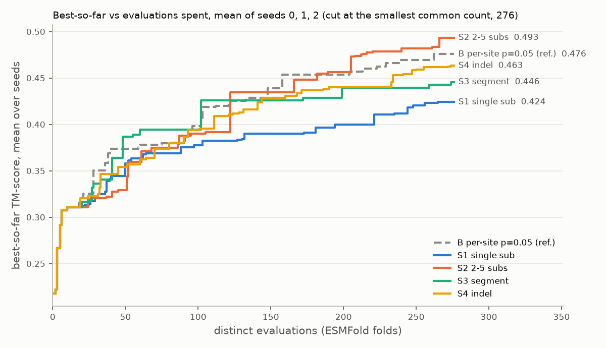

# Move class: does a different kind of move pay more per evaluation?

**Direction-finding, not a result.** Three seeds per arm. Under the fixed rule used throughout this project (X beats Y only if X is higher in *every* seed), the smallest two-sided sign-test p reachable with 3 seeds is 2/2³ = **0.25**. Nothing in this document is significant on its own. Every "beats" below is the fixed rule applied to three seeds, and should be read as a pointer toward what to test with more seeds, not as a finding.

## The question, and why it is asked this way

Evidence 4 of `results/OPERATOR_DOES_NOT_MATTER.md` measured the **greedy oracle's** candidate set (arm O). At each breeding step, each oracle slot tried 8 single-position substitutions of its own tail-slot genome, scored every one with the real fitness function, and kept the best. In 53–61% of steps none of the 8 beat the genome it already held. When one did, the mean gain was 0.0075–0.0206 TM. That candidate set was single-position **by construction of the oracle**. Evidence 4 was not measured on the deterministic GA baseline (arm B), whose mutation operator is a different move class (below).

Evidence 4 is a statement about the move class, not about who chooses the move. So this experiment holds the chooser fixed (no LLM anywhere; `HPGA_OPERATOR_MODE=deterministic`) and varies only the move class. The measured quantity is payoff per move: how often one move improves on the genome it was applied to, and by how much when it does.

## Design

Everything is arm B of `experiments/run_sequence_ga_comparison.py`, unchanged:

- population 16, 20 evaluated populations (generation 0 = random start, so 19 breeding steps), tournament 3, elitism 2
- crossover 0.9 (single proportional cut), length bounds [30, 80]
- `Random(seed)` drives everything, and every arm starts from the same generation-0 population per seed
- fitness = TM-score of the ESMFold fold against 7UR7 chain A, through the same per-run cache
- seeds 0, 1, 2

The driver (`experiments/run_move_class.py`) mirrors `run_ga`'s deterministic loop line for line. It replaces only the active model's `deterministic_mutate`, for the duration of one run, with the arm's move (`hpga/move_class.py`). `island.py`, `worker.py` and `instrumentation.py` are untouched, and nothing in `hpga/` other than the new `move_class.py` changed.

| arm | move applied to each of the 14 non-elite children per breeding step |
|---|---|
| **S1** | exactly one substitution: one position uniform, new letter uniform over the other 19 |
| **S2** | one k-position substitution: k uniform in 2–5, positions drawn without replacement, each new letter uniform over the other 19 |
| **S3** | one segment replacement: span length uniform in 5–15, start uniform over the starts where the whole span fits, span refilled with letters uniform over all 20 |
| **S4** | one indel: delete or insert with equal probability, span 1–5. A deletion's start is uniform over the starts where it fits; an insertion goes at a gap uniform over 0..len with fresh letters. A draw that would leave [30, 80] is redrawn (9 of 798 moves). |
| **B** (reference) | the existing deterministic operator: **per-site substitution with p = 0.05**, new letter uniform over all 20 (so it can equal the old one). That is about 3 substitutions per child on ~60-residue genomes, with anywhere from 0 to 6+, and 4.1% of B's moves changed nothing. |

**S1 is a new arm, not the baseline.** The deterministic baseline was never single-position. S1 was added so that S1–S4 each apply exactly one move of their class per child, which makes them comparable as move classes. Single-position gets its own arm because Evidence 4's oracle candidates were single-position. B is reported as a fifth reference row. It overlaps S2 in how many sites it touches, but it is not one move per child.

## Verification: B reproduces the published baseline, and measuring changed nothing

- **B reproduces arm B exactly, in all three seeds.** `results/raw/move_class_B_seed{0,1,2}.json` match `results/raw/sequence_ga_cmp_B_seed{0,1,2}.json` on distinct-fold count, the best-so-far curve and its generation tags, and all 20 generations' populations and fitnesses, compared as exact JSON values. Seed 0 was run and checked alone before any other arm was launched. This shows the wrapper plumbing is exact, and that S1–S4 differ from B only in the move.
- **Measurement is inert, asserted twice per run.** The base fitnesses a payoff needs (the post-crossover child, which the GA never folds unless it is an unchanged parent) were folded only after the GA had finished. They went into a separate cache and a separate file, `results/raw/move_class_bases_<arm>_seed<n>.json`, never into the run's own file. The two checks:
  1. A SHA-256 digest of the GA's outputs (distinct count, best-so-far curve and tags, every population and fitness list) was taken before any measurement fold and is identical after.
  2. The GA was replayed from the seed with move recording off, with fitness served only from the run's own cache; a genome the run never folded would have raised. The replay's digest is identical to the run's.

  Both checks passed for all 15 runs (`summary.inertness` in each run file). For B, the published-run match is a third, external check of the same thing.
- **What measuring cost.** Measurement folds are extra fold time, charged to nothing in the search. All times below are wall-clock seconds recorded around the folds and the runs. Nothing in the files records GPU utilisation, so none of this is a measurement of GPU time.

| arm | extra folds per seed (0 / 1 / 2) | measurement share of fold time per seed |
|---|---|---|
| S1 | 95 / 158 / 144 | 26.6% / 35.4% / 33.6% |
| S2 | 210 / 174 / 179 | 41.9% / 39.8% / 38.9% |
| S3 | 188 / 146 / 138 | 39.8% / 32.4% / 32.6% |
| S4 | 185 / 192 / 183 | 40.0% / 41.2% / 39.5% |
| B | 168 / 172 / 161 | 43.2% / 38.4% / 36.6% |

Per arm, over its three seeds. The last two columns are **different quantities**:

- **Share of fold time** is measurement fold seconds ÷ (measurement fold seconds + the GA's own fold seconds), from `measurement_fold_s` and `ga_fold_s` in each bases file.
- **Share of total run time** is measurement fold seconds ÷ each run's end-to-end driver time. That time covers the GA, the measurement folds and the inertness checks, and comes from `seconds` in `move_class_status.json` (and `move_class_status_b_seed0_check.json` for B seed 0).

| arm | extra folds | share of fold time | share of total run time |
|---|---|---|---|
| S1 | 397 | 32.5% | 32.3% |
| S2 | 563 | 40.1% | 39.9% |
| S3 | 472 | 34.8% | 34.6% |
| S4 | 560 | 40.2% | 40.0% |
| B | 501 | 39.0% | 38.8% |
| all 15 runs | 2,493 | 37.5% | 37.3% |

Across all 15 runs that is 2,493 measurement folds and 1.74 fold-hours, against 2.90 fold-hours of the GA's own folds: 37.5% of all fold time. Total driver time for the 15 runs was 4.67 hours, of which measurement folds were 37.3%.

S1 needed the fewest extra folds: 397. Its bases were already in the run's cache for 379 of its 798 moves, against 224–316 of 798 for the other arms. Nothing in the files explains why. It is not the unchanged-parent effect: a no-crossover child's base is a parent that is already cached, in every arm alike.

## 1. Best fitness at the common evaluation count

Each seed is read at `n_cut`, the smallest distinct-fold count any of the five arms reached in that seed: 278, 276 and 280 for seeds 0, 1 and 2. B sets `n_cut` in every seed, because its unchanged children are cache hits. S1–S4 reached 281–282 distinct folds.

| arm | seed 0 | seed 1 | seed 2 | mean |
|---|---|---|---|---|
| S1 single substitution | 0.4031 | 0.3875 | 0.4816 | 0.4241 |
| S2 2–5 substitutions | 0.4107 | **0.6522** | 0.4175 | **0.4935** |
| S3 segment 5–15 | 0.3910 | 0.4193 | **0.5265** | 0.4456 |
| S4 indel 1–5 | **0.4379** | 0.4770 | 0.4750 | 0.4633 |
| B per-site p=0.05 (reference) | 0.4203 | 0.5025 | 0.5040 | 0.4756 |

**Only one pair is ordered in every seed: B beats S1** (0.4203 > 0.4031, 0.5025 > 0.3875, 0.5040 > 0.4816). No move class beats any other move class in every seed. The best arm changes with the seed: S4 in seed 0, S2 in seed 1, S3 in seed 2.

S2's lead in the mean comes from one seed. Seed 1's 0.6522 is the highest best fitness of any run in `results/raw/`, but only 0.015 above `sequence_ga_cmp_D_seed1.json` (0.6372, arm D of the five-arm sequence comparison). It does not stand apart from earlier runs. It is a sustained climb in four steps over generations 8–18, not a single lucky fold: the population best goes 0.39 → 0.52 (generation 8) → 0.56 (11) → 0.62 (14) → 0.65 (18). The best genome is 55 edits from the native sequence. The largest single step was one 4-position S2 move at step 13 that took a 0.3515 base to 0.6162. In seeds 0 and 2, S2 is below B.

## 2. Fitness trajectory, mean over seeds, against evaluations spent

| evaluations | S1 | S2 | S3 | S4 | B |
|---|---|---|---|---|---|
| 16 | 0.3106 | 0.3106 | 0.3106 | 0.3106 | 0.3106 |
| 48 | 0.3444 | 0.3293 | 0.3867 | 0.3540 | 0.3737 |
| 96 | 0.3755 | 0.3897 | 0.3942 | 0.3936 | 0.3983 |
| 144 | 0.3900 | 0.4343 | 0.4259 | 0.4286 | 0.4284 |
| 192 | 0.3968 | 0.4565 | 0.4286 | 0.4402 | 0.4535 |
| 240 | 0.4118 | 0.4818 | 0.4394 | 0.4528 | 0.4695 |
| 276 | 0.4241 | 0.4935 | 0.4456 | 0.4633 | 0.4756 |

(Every 16 evaluations: `results/MOVE_CLASS_TABLES.md` §2. Every evaluation: `results/move_class_summary.json`, `trajectory_full`.) The first 16 evaluations are the shared generation 0. S1 is the lowest mean curve from evaluation 70 on, strictly below all four others at every evaluation from 70 to 276. The other four stay within about 0.03 of each other until S2's seed-1 climb separates it after about 200 evaluations.

## 3. Payoff per move: share that improve on their base, and mean gain when they do

A move is one mutation call on one post-crossover child. It improves if the child's fitness is strictly above its base's. The table covers all 19 breeding steps, with 266 moves per run.

Improved is shown as improving moves / moves.

| arm | improved: seed 0 / 1 / 2 | **improved, pooled** | gain if improved: seed 0 / 1 / 2 | **gain if improved, pooled** | expected positive gain per move (share × gain), pooled |
|---|---|---|---|---|---|
| S1 | 65/266 (24.4%) / 89/266 (33.5%) / 91/266 (34.2%) | **245/798 (30.7%)** | 0.0230 / 0.0204 / 0.0227 | **0.0220** | 0.0067 |
| S2 | 91/266 (34.2%) / 90/266 (33.8%) / 92/266 (34.6%) | **273/798 (34.2%)** | 0.0293 / 0.0487 / 0.0252 | **0.0343** | 0.0118 |
| S3 | 88/266 (33.1%) / 84/266 (31.6%) / 54/266 (20.3%) | **226/798 (28.3%)** | 0.0296 / 0.0332 / 0.0366 | **0.0326** | 0.0092 |
| S4 | 92/266 (34.6%) / 105/266 (39.5%) / 107/266 (40.2%) | **304/798 (38.1%)** | 0.0253 / 0.0360 / 0.0311 | **0.0310** | 0.0118 |
| B | 77/266 (28.9%) / 89/266 (33.5%) / 84/266 (31.6%) | **250/798 (31.3%)** | 0.0199 / 0.0339 / 0.0358 | **0.0302** | 0.0095 |

Orderings that hold in every seed:

- **Share improved: S4 is higher than every other arm (S1, S2, S3 and B) in every seed.** S2 is higher than S1, S3 and B in every seed.
- **Gain if improved: S2, S3 and S4 are each higher than S1 in every seed.** No other pair is ordered in every seed.

So, per move, single-position substitution is at the bottom on both numbers. Its gain when it improves is the lowest of the four move classes in every seed. Its improvement rate is below S2 and S4 in every seed and above only S3's pooled figure. A single random substitution to a crossover child pays about 0.022 TM when it helps. A 2–5-site substitution, a segment or an indel pays about 0.031–0.034. Indels help most often.

Most moves hurt in every arm. Pooled over seeds, 62–72% of each arm's moves are worse than their base. Per run the range is 59.8% (S4 seed 2) to 79.7% (S3 seed 2), and the mean gain over all moves is negative everywhere: S4 −0.020, S1 −0.022, S2 −0.025, B −0.033, S3 −0.038. No S1–S4 move landed exactly on its base's fitness. Only B, whose per-site draw can change nothing, has equal-fitness moves (4.1%).

**How this relates to Evidence 4.** S1's gain when it improves (0.020–0.023) is of the same order as the oracle's gain when it moved (0.0075–0.0206). But these are not the same statistic, so they should not be read as a replication:

- The oracle's figure is the best of 8 candidates, applied to a tail-slot genome it had already been climbing, with greedy acceptance.
- S1's figure is one random substitution applied to a fresh crossover child, which is often less fit than either parent and so easier to improve on.

What the two share is magnitude: a single substitution buys roughly 0.02 TM when it helps, in both settings.

## 4. The same two numbers by generation thirds

Thirds are by breeding step: early = steps 0–5, middle = 6–11, late = 12–18. The children are evaluated in generations 1–6, 7–12 and 13–19. Each run has 84 moves in the early third, 84 in the middle third and 98 in the late third.

**Pooled over seeds**, as improved / moves (share), gain if improved:

| arm | early | middle | late |
|---|---|---|---|
| S1 | 103/252 (40.9%), 0.0223 | 58/252 (23.0%), 0.0193 | 84/294 (28.6%), 0.0234 |
| S2 | 109/252 (43.3%), 0.0303 | 78/252 (31.0%), 0.0339 | 86/294 (29.3%), 0.0399 |
| S3 | 94/252 (37.3%), 0.0351 | 71/252 (28.2%), 0.0330 | 61/294 (20.7%), 0.0284 |
| S4 | 111/252 (44.0%), 0.0298 | 88/252 (34.9%), 0.0306 | 105/294 (35.7%), 0.0327 |
| B | 98/252 (38.9%), 0.0275 | 63/252 (25.0%), 0.0309 | 89/294 (30.3%), 0.0328 |

**Per seed**, as improved / moves (share), gain if improved:

| arm | seed | early | middle | late |
|---|---|---|---|---|
| S1 | 0 | 30/84 (35.7%), 0.0213 | 13/84 (15.5%), 0.0175 | 22/98 (22.4%), 0.0287 |
| S1 | 1 | 35/84 (41.7%), 0.0227 | 26/84 (31.0%), 0.0186 | 28/98 (28.6%), 0.0193 |
| S1 | 2 | 38/84 (45.2%), 0.0227 | 19/84 (22.6%), 0.0215 | 34/98 (34.7%), 0.0234 |
| S2 | 0 | 39/84 (46.4%), 0.0382 | 23/84 (27.4%), 0.0224 | 29/98 (29.6%), 0.0229 |
| S2 | 1 | 37/84 (44.0%), 0.0294 | 26/84 (31.0%), 0.0545 | 27/98 (27.6%), 0.0697 |
| S2 | 2 | 33/84 (39.3%), 0.0221 | 29/84 (34.5%), 0.0246 | 30/98 (30.6%), 0.0294 |
| S3 | 0 | 33/84 (39.3%), 0.0326 | 31/84 (36.9%), 0.0314 | 24/98 (24.5%), 0.0233 |
| S3 | 1 | 36/84 (42.9%), 0.0380 | 22/84 (26.2%), 0.0292 | 26/98 (26.5%), 0.0299 |
| S3 | 2 | 25/84 (29.8%), 0.0341 | 18/84 (21.4%), 0.0405 | 11/98 (11.2%), 0.0359 |
| S4 | 0 | 34/84 (40.5%), 0.0275 | 27/84 (32.1%), 0.0226 | 31/98 (31.6%), 0.0252 |
| S4 | 1 | 34/84 (40.5%), 0.0305 | 32/84 (38.1%), 0.0308 | 39/98 (39.8%), 0.0449 |
| S4 | 2 | 43/84 (51.2%), 0.0311 | 29/84 (34.5%), 0.0377 | 35/98 (35.7%), 0.0256 |
| B | 0 | 32/84 (38.1%), 0.0191 | 16/84 (19.0%), 0.0166 | 29/98 (29.6%), 0.0226 |
| B | 1 | 40/84 (47.6%), 0.0325 | 21/84 (25.0%), 0.0297 | 28/98 (28.6%), 0.0390 |
| B | 2 | 26/84 (31.0%), 0.0303 | 26/84 (31.0%), 0.0406 | 32/98 (32.7%), 0.0365 |

- **Every arm improves most often early.** Random-start genomes are easy to improve on. The improvement rate falls by the middle third in every arm.
- **S4 has the highest pooled improvement rate in every third,** and it holds up best late (35.7%, against 20.7–30.3% for the others). **Per seed, it is not the highest in every third.** Of the 9 seed-by-third cells, S4 has the strictly highest improvement rate of all five arms in 5. It ties S2 for highest in 1 (middle seed 2, 29/84 each). The other three go to S2 (early seed 0), B (early seed 1) and S3 (middle seed 0).
- **S4 against B, per seed: S4 is higher in 8 of 9 cells.** The exception is early seed 1: B 40/84, S4 34/84.
- **S2 against B, per seed: S2 is higher early in seeds 0 and 2 and in the middle third in all three seeds, but it is not higher than B late in any seed.** Late, seed 0 is tied at 29/98 each, seed 1 is 27/98 against 28/98, and seed 2 is 30/98 against 32/98. Early seed 1 also goes to B (40/84 against 37/84). So S2's whole-run lead over B in every seed comes from the first two thirds. By the late third it no longer improves more often than the per-site baseline.
- **S3 declines steadily** (37% → 28% → 21% pooled, with seed 2 late at 11/98, 11.2%). Replacing 5–15 residues of a genome that selection has already shaped mostly destroys what was there. Its pooled gain when it does improve also shrinks late.
- **S2's pooled gain if improved rises** (0.030 → 0.034 → 0.040) while its improvement rate falls, **but that rise is driven by seed 1**, whose late value is 0.0697. Per seed, the pattern is mixed. Seed 0 falls (0.0382 → 0.0224 → 0.0229), seed 1 rises steeply (0.0294 → 0.0545 → 0.0697) and seed 2 rises modestly (0.0221 → 0.0246 → 0.0294). Seed 1 is the run with S2's 0.6522 climb, so the pooled figure should not be read as "multi-site substitution helps by more late in the run" in general.
- **S1's gain if improved is the lowest of the five arms in every third, pooled,** staying near 0.02 throughout. Its pooled improvement rate is the lowest in the middle third, second-lowest late and middling early.

## 5. S4 genome length over time

All evaluated S4 genomes per generation, pooled over the three seeds. Per-generation min, quartiles, max and per-seed means for all 20 generations are in `results/MOVE_CLASS_TABLES.md` §5.

| generation | min | q1 | median | q3 | max | mean | per-seed mean (0 / 1 / 2) |
|---|---|---|---|---|---|---|---|
| 0 | 30 | 42.0 | 54.0 | 62.0 | 79 | 53.1 | 52.0 / 52.7 / 54.8 |
| 2 | 47 | 58.0 | 65.0 | 69.8 | 79 | 63.8 | 62.6 / 64.7 / 64.1 |
| 5 | 49 | 62.0 | 66.5 | 72.0 | 79 | 66.2 | 65.0 / 64.8 / 69.0 |
| 10 | 57 | 64.0 | 67.0 | 71.0 | 80 | 67.3 | 66.9 / 62.9 / 71.9 |
| 15 | 58 | 63.0 | 68.0 | 71.8 | 80 | 67.9 | 65.1 / 64.9 / 73.6 |
| 19 | 57 | 63.0 | 67.5 | 75.0 | 80 | 68.2 | 64.5 / 64.5 / 75.6 |

- **Length rises fast, then plateaus.** It goes from the uniform [30, 80] start (mean 53) to about 64 within two generations, then drifts slowly up to about 68. The short genomes are selected out early: the minimum is ≥ 44 from generation 2 on. The native reference is 63 residues.
- **Seed 2 keeps growing,** reaching a mean of 75.6 at generation 19, close to the 80-residue upper bound.
- **Insertions helped more often than deletions:** 170/403 insertions improved (42.2%), against 134/395 deletions (33.9%), with the same gain when they did (0.0309 vs 0.0312).
- **Drift is not S4-specific.** Crossover's proportional cut also changes length, and every arm drifts upward. The final-generation mean length per seed was 59 / 67 / 63 for S1, 54 / 64 / 68 for S2, 57 / 59 / 67 for S3, 65 / 65 / 76 for S4 and 59 / 64 / 72 for B. S4 ends longest in seeds 0 and 2, but by a few residues, not a different regime.

## What this says, and what it does not

**None of this is significant on its own.** Every ordering below is the fixed rule (higher in every seed) applied to three seeds. With three seeds the smallest two-sided sign-test p is 0.25. The orderings are directions to test with more seeds, not findings.

**Move class changes per-move payoff in a direction that is consistent across seeds.** Over the whole run, in all three seeds:

- indels (S4) improve on their base more often than every other arm;
- 2–5-site substitutions (S2) improve more often than S1, S3 and B;
- every larger move class (S2, S3, S4) gains more than single substitution when it improves.

Two qualifications, both from the per-seed thirds in section 4:

- **S4 leads over the whole run in every seed and, pooled over seeds, in every third, but not in every third of every seed.** Against B it is higher in 8 of 9 seed-by-third cells; the exception is early seed 1 (B 40/84, S4 34/84). Against all four other arms it is strictly highest in only 5 of 9, and tied for highest in a sixth.
- **S2's lead over B does not reach the late third.** Late, S2 is tied with B in seed 0 (29/98 each) and below it in seeds 1 (27/98 against 28/98) and 2 (30/98 against 32/98).

On expected gain per move (hit rate × mean gain when improved), pooled over seeds, single-position substitution (S1) is the lowest of the five arms: 0.0067 against 0.0092–0.0118. It is lowest in seeds 0 and 1 but not in seed 2, where S3 is lower (0.0074 against S1's 0.0078). S1 does not have the lowest hit rate: S3's pooled rate is lower (226/798 against 245/798). Its gain when it improves is the lowest of the four move classes in every seed. The per-site baseline B beats S1 on final fitness in every seed. That fits Evidence 4's reading that single-position edits are a weak move here. It is also consistent with the weakness not being unique to the oracle's setting: pooled, one random substitution to a crossover child is the least productive move tested.

**It did not turn into a fitness ordering among move classes.** S4 improves more often than every other arm in all three seeds, and S2 more often than S1, S3 and B in all three seeds. Yet on best fitness at the common budget, no arm beats another in every seed except B > S1, and neither S4 nor S2 is in that pair. A higher share of improving moves did not turn into higher final fitness at this budget.

*Interpretation, not a demonstrated fact:* the move class changes the hit rate without changing the outcome. That is consistent with the evaluation budget (about 280 folds per run), not the quality of the move, being the binding constraint on final fitness here. Three seeds cannot establish this. The same pattern would also arise if the pooled hit-rate differences behind those orderings (2.9 to 9.8 percentage points) are simply too small to show through seed-to-seed variance in three runs. The data here cannot tell these two readings apart.

Per-move payoff is one input into search quality. The best at n_cut also depends on the rare large jumps (S2 seed 1's +0.265 move), which three seeds cannot average out.

**Caveats specific to this design:**

- **Bases are not matched across arms.** Each arm's moves were applied to its own population's crossover children, so part of any payoff difference is a difference in what was being mutated. Generation 0 and the first selected pair of step 0 are shared, and everything after diverges. A matched-base design (every move class applied to the same set of bases, off-budget) would isolate the move class exactly. That would be the natural follow-up if the per-move ordering above is worth pinning down.
- **One move per child, one mutation rate.** S1–S4 ignore the 0.05 rate by design. Whether two S4 moves per child, or a mix of S2 and S4, does better was not tested.
- **"Improves on its base" is measured against the post-crossover child,** not against either parent. A crossover child is often worse than both parents, so these improvement rates are not rates of beating the parents.
- **Same scope as every other result in this project:** one target (7UR7 chain A, 63 residues), one fitness function, population 16, 20 generations, about 280 folds per run, three seeds.

**Suggested direction, not a conclusion:** if move class is taken further, S4 (highest improvement rate in every seed over the whole run, and in every third pooled over seeds) and S2 (highest pooled gain when it improves, though above only S1 in every seed, and with its late rise driven by seed 1) are the candidates to test with more seeds, and S1 is the one to drop.

## Files

- `hpga/move_class.py`: the five move functions
- `experiments/run_move_class.py`: the driver, including the verification and measurement steps
- `experiments/summarize_move_class.py`: generates `results/MOVE_CLASS_TABLES.md`, `results/move_class_summary.json` and `results/move_class.png`
- `results/raw/move_class_{S1,S2,S3,S4,B}_seed{0,1,2}.json`: the 15 runs, in the same schema as `sequence_ga_cmp_*`, plus per-generation `lengths`
- `results/raw/move_class_bases_{arm}_seed{n}.json`: every move with its base and child genomes and fitnesses (measurement only)
- `results/raw/move_class_run.log`, `results/raw/move_class_status.json`: the 14-run launch
- `results/raw/move_class_b_seed0_check.log`, `results/raw/move_class_status_b_seed0_check.json`: the B seed 0 check run, launched alone before the others
