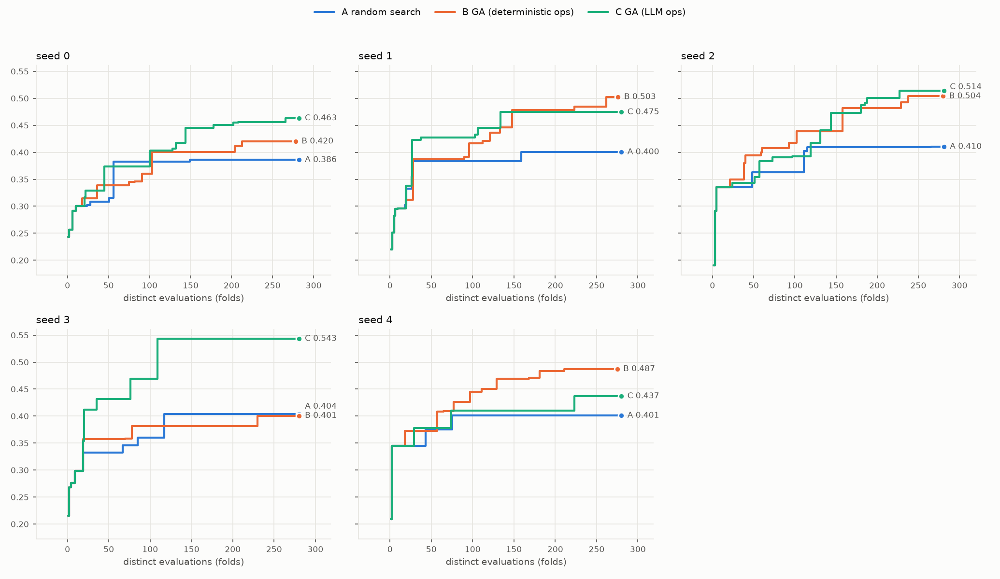

# Sequence-mode search comparison: random search vs GA vs GA with LLM operators

*Branch `tm-score-fitness`. Produced unattended, 2026-09-18 22:55 to 2026-09-19 05:30. Every table and the chart are generated from the raw
files in `results/raw/` by `experiments/summarize_sequence_ga_comparison.py`; nothing in the tables is typed by hand. Figures quoted in the prose are
computed from the same files or read off those tables. This file is
new and `PHASE3_RESULTS.md` is untouched. Fitness is the TM-score of the ESMFold-predicted structure against 7UR7 chain A (63 residues),
normalised by the reference length, from `esmfold/tm_fitness.py`. Reference-sequence TM against itself is 0.9137.*

## 1. The plain statement

Five seeds (0-4), three arms, 15 runs, all completed, no crashes, no retries. Every arm's budget is the same measure: **275-282 distinct folds**, and each comparison below is made at exactly equal distinct-evaluation budget.

| arm | mean final best TM over 5 seeds | range over seeds |
|---|---|---|
| A random search | 0.4002 | 0.3859 – 0.4104 |
| B GA, deterministic operators | 0.4630 | 0.4007 – 0.5040 |
| C GA, LLM operators (mutate=position, crossover=segment) | 0.4864 | 0.4370 – 0.5434 |

The rule for "beats" was fixed before any result was read: X beats Y only if X is higher in **every** seed compared. With 5 seeds the
smallest two-sided sign-test p-value that can be reached is 0.0625, so no comparison here can be called statistically significant at 0.05.

- **Does B beat A? No, not under that rule.** **NO DEMONSTRATED DIFFERENCE between B and A: B higher in 4, lower in 1, tied in 0 of 5 seeds.** Higher in 4 of 5 seeds; mean difference +0.0627 (range -0.0028 to +0.1021). B is above A in seeds 0, 1, 2 and 4; in seed 3 A is
  higher by 0.0028 (B 0.4007, A 0.4035), which is a wash, but it means B did not win every seed.
- **Does C beat A? Yes, under that rule, and it is not significant.** **C BEATS A under the pre-set rule (higher in all 5 of 5 seeds).** Higher in 5 of 5 seeds; mean difference +0.0862 (range +0.0361 to +0.1399). C is above A in all 5 seeds; with 5 seeds the
  smallest p possible is 0.0625.
- **Does C beat B? No.** **NO DEMONSTRATED DIFFERENCE between C and B: C higher in 3, lower in 2, tied in 0 of 5 seeds.** Higher in 3 of 5 seeds; mean difference +0.0234 (range -0.0502 to +0.1427). C is ahead in seeds 0, 2 and 3 (seed 3 by 0.1427) and behind in seeds 1 and 4. The data show no difference
  between LLM operators and deterministic operators that this design can detect.

What these comparisons do **not** show. All three arms end far from the reference. Final best TM ranges 0.386-0.543; only
2 of 5 B runs and 2 of 5 C runs finish above 0.5 (the usual same-fold threshold), and no A run does. The final best genomes are
52-67 edits from the 63-residue reference sequence (edit distance; section 5), i.e. essentially unrelated sequences: the search is finding
sequences that ESMFold folds a little more like 7UR7, not sequences near it.

## 2. What is compared

| | A random search | B GA, deterministic | C GA, LLM operators |
|---|---|---|---|
| how genomes arise | uniform random, drawn as `random_population` draws them | selection + deterministic crossover/mutation | selection + LLM crossover (`segment`) and mutate (`position`) |
| population / generations | - | 16 / 20 | 16 / 20 |
| budget | up to the larger distinct-evaluation count of B and C for the same seed | ~275-282 distinct folds (elites and repeats are cache hits) | ~280-282 distinct folds |

Everything else is at `HPGAConfig` defaults, identical in B and C: crossover rate 0.9, mutation rate 0.05, tournament size 3, elitism 2, length bounds [30, 80].
LLM: `gemma4:12b`, temperature 0.7, default retries. "20 generations" means 20 evaluated populations (generation 0 is the random start), so 19 breeding steps,
which is what `Island.run` means by `n_generations`. For a given seed, **B, C and the first 16 draws of A share the same generation-0 population** (same seed, same draw order), so the
curves coincide for the first 16 evaluations and differ only afterwards. Fitness is deterministic, so a genome scored again is served from a per-run cache; "distinct evaluations" counts folds
actually run and "cache hits" counts re-uses, reported separately in section 1 of the tables.



*Best-so-far TM-score against distinct evaluations, one panel per seed (never pooled). The three arms overlap for the first 16 evaluations by construction.*

## 3. Results

### 1. Runs

| seed | arm | distinct evaluations | cache hits | final best TM | final best length | edit distance to reference | attempt |
|---|---|---|---|---|---|---|---|
| 0 | A random search | 282 | 0 | 0.3859 | 50 | 55 | 1 |
| 0 | B GA (deterministic ops) | 278 | 42 | 0.4203 | 59 | 55 | 1 |
| 0 | C GA (LLM ops) | 282 | 38 | 0.4632 | 59 | 54 | 1 |
| 1 | A random search | 280 | 0 | 0.4004 | 79 | 67 | 1 |
| 1 | B GA (deterministic ops) | 276 | 44 | 0.5025 | 64 | 55 | 1 |
| 1 | C GA (LLM ops) | 280 | 40 | 0.4745 | 62 | 54 | 1 |
| 2 | A random search | 281 | 0 | 0.4104 | 66 | 58 | 1 |
| 2 | B GA (deterministic ops) | 280 | 40 | 0.5040 | 72 | 56 | 1 |
| 2 | C GA (LLM ops) | 281 | 39 | 0.5138 | 72 | 59 | 1 |
| 3 | A random search | 280 | 0 | 0.4035 | 59 | 55 | 1 |
| 3 | B GA (deterministic ops) | 280 | 40 | 0.4007 | 70 | 63 | 1 |
| 3 | C GA (LLM ops) | 280 | 40 | 0.5434 | 57 | 52 | 1 |
| 4 | A random search | 280 | 0 | 0.4009 | 62 | 55 | 1 |
| 4 | B GA (deterministic ops) | 275 | 45 | 0.4873 | 62 | 59 | 1 |
| 4 | C GA (LLM ops) | 280 | 40 | 0.4370 | 69 | 59 | 1 |

### 2. Best-so-far TM-score vs distinct evaluations (per seed, never pooled)

**Seed 0**

| distinct evaluations | A random search | B GA (deterministic ops) | C GA (LLM ops) |
|---|---|---|---|
| 16 | 0.3006 | 0.3006 | 0.3006 |
| 32 | 0.3081 | 0.3150 | 0.3287 |
| 64 | 0.3824 | 0.3392 | 0.3734 |
| 96 | 0.3824 | 0.3605 | 0.3734 |
| 128 | 0.3824 | 0.4003 | 0.4072 |
| 160 | 0.3859 | 0.4003 | 0.4454 |
| 192 | 0.3859 | 0.4003 | 0.4504 |
| 224 | 0.3859 | 0.4203 | 0.4560 |
| 256 | 0.3859 | 0.4203 | 0.4560 |
| own final (n) | 0.3859 (282) | 0.4203 (278) | 0.4632 (282) |

**Seed 1**

| distinct evaluations | A random search | B GA (deterministic ops) | C GA (LLM ops) |
|---|---|---|---|
| 16 | 0.2959 | 0.2959 | 0.2959 |
| 32 | 0.3838 | 0.3871 | 0.4227 |
| 64 | 0.3838 | 0.3871 | 0.4272 |
| 96 | 0.3838 | 0.4170 | 0.4272 |
| 128 | 0.3838 | 0.4367 | 0.4457 |
| 160 | 0.4004 | 0.4782 | 0.4745 |
| 192 | 0.4004 | 0.4782 | 0.4745 |
| 224 | 0.4004 | 0.4843 | 0.4745 |
| 256 | 0.4004 | 0.4843 | 0.4745 |
| own final (n) | 0.4004 (280) | 0.5025 (276) | 0.4745 (280) |

**Seed 2**

| distinct evaluations | A random search | B GA (deterministic ops) | C GA (LLM ops) |
|---|---|---|---|
| 16 | 0.3353 | 0.3353 | 0.3353 |
| 32 | 0.3353 | 0.3492 | 0.3433 |
| 64 | 0.3629 | 0.4074 | 0.3833 |
| 96 | 0.3629 | 0.4175 | 0.3908 |
| 128 | 0.4094 | 0.4386 | 0.4174 |
| 160 | 0.4094 | 0.4821 | 0.4732 |
| 192 | 0.4094 | 0.4821 | 0.5004 |
| 224 | 0.4094 | 0.4821 | 0.5004 |
| 256 | 0.4094 | 0.5040 | 0.5138 |
| own final (n) | 0.4104 (281) | 0.5040 (280) | 0.5138 (281) |

**Seed 3**

| distinct evaluations | A random search | B GA (deterministic ops) | C GA (LLM ops) |
|---|---|---|---|
| 16 | 0.2983 | 0.2983 | 0.2983 |
| 32 | 0.3320 | 0.3572 | 0.4124 |
| 64 | 0.3320 | 0.3572 | 0.4319 |
| 96 | 0.3605 | 0.3820 | 0.4696 |
| 128 | 0.4035 | 0.3820 | 0.5434 |
| 160 | 0.4035 | 0.3820 | 0.5434 |
| 192 | 0.4035 | 0.3820 | 0.5434 |
| 224 | 0.4035 | 0.3820 | 0.5434 |
| 256 | 0.4035 | 0.4007 | 0.5434 |
| own final (n) | 0.4035 (280) | 0.4007 (280) | 0.5434 (280) |

**Seed 4**

| distinct evaluations | A random search | B GA (deterministic ops) | C GA (LLM ops) |
|---|---|---|---|
| 16 | 0.3447 | 0.3447 | 0.3447 |
| 32 | 0.3447 | 0.3727 | 0.3777 |
| 64 | 0.3756 | 0.4080 | 0.3777 |
| 96 | 0.4009 | 0.4263 | 0.4104 |
| 128 | 0.4009 | 0.4506 | 0.4104 |
| 160 | 0.4009 | 0.4691 | 0.4104 |
| 192 | 0.4009 | 0.4835 | 0.4104 |
| 224 | 0.4009 | 0.4873 | 0.4370 |
| 256 | 0.4009 | 0.4873 | 0.4370 |
| own final (n) | 0.4009 (280) | 0.4873 (275) | 0.4370 (280) |

### 3. Final best per seed; then mean and range over seeds

| arm | seed 0 | seed 1 | seed 2 | seed 3 | seed 4 |
|---|---|---|---|---|---|
| A random search (own budget) | 0.3859 | 0.4004 | 0.4104 | 0.4035 | 0.4009 |
| B GA (deterministic ops) (own budget) | 0.4203 | 0.5025 | 0.5040 | 0.4007 | 0.4873 |
| C GA (LLM ops) (own budget) | 0.4632 | 0.4745 | 0.5138 | 0.5434 | 0.4370 |
| A read at B's distinct-evaluation count | 0.3859 | 0.4004 | 0.4104 | 0.4035 | 0.4009 |
| A read at C's distinct-evaluation count | 0.3859 | 0.4004 | 0.4104 | 0.4035 | 0.4009 |

Cross-seed summary (the only pooled table; n = number of seeds that finished):

| arm | n seeds | mean final best | range (min – max) |
|---|---|---|---|
| A (own budget) | 5 | 0.4002 | 0.3859 – 0.4104 |
| A at B's budget | 5 | 0.4002 | 0.3859 – 0.4104 |
| A at C's budget | 5 | 0.4002 | 0.3859 – 0.4104 |
| B | 5 | 0.4630 | 0.4007 – 0.5040 |
| C | 5 | 0.4864 | 0.4370 – 0.5434 |

### 4. Mean pairwise edit distance within the population, per generation

| gen | B s0 | B s1 | B s2 | B s3 | B s4 | C s0 | C s1 | C s2 | C s3 | C s4 |
|---|---|---|---|---|---|---|---|---|---|---|
| 0 | 50.3 | 50.5 | 53.0 | 53.9 | 52.2 | 50.3 | 50.5 | 53.0 | 53.9 | 52.2 |
| 1 | 42.0 | 52.1 | 51.3 | 52.5 | 47.8 | 42.4 | 49.6 | 54.6 | 51.0 | 50.9 |
| 2 | 40.9 | 47.2 | 32.5 | 41.8 | 47.0 | 38.9 | 50.5 | 47.7 | 47.1 | 48.8 |
| 3 | 38.2 | 44.4 | 24.4 | 35.9 | 45.9 | 26.4 | 38.2 | 40.9 | 30.3 | 44.7 |
| 4 | 31.1 | 46.1 | 24.0 | 37.8 | 34.2 | 27.5 | 37.4 | 25.1 | 14.1 | 36.8 |
| 5 | 18.6 | 37.8 | 18.7 | 37.8 | 33.9 | 28.5 | 33.7 | 19.2 | 11.7 | 28.6 |
| 6 | 14.3 | 20.1 | 18.7 | 36.8 | 28.4 | 28.8 | 24.3 | 15.5 | 10.7 | 27.5 |
| 7 | 14.8 | 17.4 | 26.6 | 34.5 | 20.9 | 21.1 | 19.6 | 10.4 | 10.5 | 27.2 |
| 8 | 15.5 | 15.1 | 23.9 | 27.5 | 22.7 | 18.3 | 18.3 | 9.4 | 11.0 | 27.1 |
| 9 | 14.2 | 14.1 | 28.9 | 26.6 | 18.6 | 17.1 | 18.4 | 12.1 | 10.7 | 27.5 |
| 10 | 15.8 | 13.7 | 25.0 | 20.2 | 17.7 | 10.0 | 20.0 | 10.7 | 10.5 | 27.7 |
| 11 | 14.1 | 14.5 | 24.1 | 16.6 | 9.8 | 9.2 | 19.2 | 10.5 | 9.0 | 26.5 |
| 12 | 16.8 | 16.5 | 30.2 | 18.1 | 9.2 | 8.0 | 20.3 | 10.8 | 7.6 | 26.2 |
| 13 | 14.4 | 16.3 | 33.4 | 21.2 | 10.5 | 7.5 | 18.3 | 10.4 | 7.2 | 23.1 |
| 14 | 18.4 | 17.0 | 35.2 | 17.7 | 14.4 | 7.5 | 18.6 | 11.1 | 7.0 | 15.8 |
| 15 | 18.4 | 15.1 | 33.3 | 20.2 | 13.4 | 9.0 | 20.1 | 11.8 | 6.7 | 9.6 |
| 16 | 17.6 | 17.9 | 21.8 | 19.1 | 14.5 | 8.1 | 18.5 | 12.9 | 6.2 | 9.8 |
| 17 | 14.6 | 14.3 | 19.0 | 13.3 | 13.9 | 8.1 | 18.2 | 13.8 | 7.2 | 8.9 |
| 18 | 14.4 | 17.6 | 15.4 | 11.8 | 12.9 | 8.0 | 12.4 | 10.7 | 8.1 | 9.1 |
| 19 | 17.0 | 14.0 | 16.8 | 12.1 | 15.1 | 7.7 | 10.9 | 8.8 | 6.5 | 10.2 |

Distinct genomes in the population (of 16), same columns:

| gen | B s0 | B s1 | B s2 | B s3 | B s4 | C s0 | C s1 | C s2 | C s3 | C s4 |
|---|---|---|---|---|---|---|---|---|---|---|
| 0 | 16 | 16 | 16 | 16 | 16 | 16 | 16 | 16 | 16 | 16 |
| 1 | 16 | 16 | 16 | 16 | 16 | 16 | 16 | 16 | 16 | 16 |
| 2 | 15 | 16 | 16 | 15 | 16 | 16 | 16 | 16 | 16 | 16 |
| 3 | 15 | 16 | 16 | 16 | 16 | 16 | 16 | 16 | 16 | 16 |
| 4 | 15 | 16 | 16 | 16 | 16 | 16 | 16 | 16 | 16 | 16 |
| 5 | 14 | 16 | 16 | 16 | 16 | 16 | 16 | 15 | 16 | 16 |
| 6 | 16 | 16 | 16 | 16 | 16 | 16 | 16 | 15 | 16 | 16 |
| 7 | 16 | 16 | 16 | 16 | 16 | 16 | 16 | 16 | 16 | 16 |
| 8 | 16 | 16 | 16 | 16 | 16 | 16 | 16 | 16 | 15 | 16 |
| 9 | 16 | 16 | 16 | 16 | 16 | 16 | 16 | 16 | 16 | 16 |
| 10 | 16 | 16 | 16 | 16 | 16 | 16 | 16 | 16 | 16 | 16 |
| 11 | 16 | 16 | 16 | 16 | 16 | 16 | 16 | 16 | 16 | 16 |
| 12 | 16 | 16 | 16 | 16 | 16 | 16 | 16 | 16 | 16 | 16 |
| 13 | 16 | 16 | 16 | 16 | 16 | 16 | 16 | 16 | 16 | 16 |
| 14 | 16 | 14 | 16 | 16 | 16 | 16 | 16 | 16 | 16 | 16 |
| 15 | 16 | 15 | 16 | 16 | 16 | 16 | 15 | 16 | 16 | 16 |
| 16 | 16 | 15 | 16 | 16 | 16 | 16 | 16 | 16 | 16 | 16 |
| 17 | 15 | 16 | 16 | 16 | 16 | 16 | 16 | 16 | 16 | 16 |
| 18 | 16 | 16 | 15 | 16 | 15 | 16 | 16 | 16 | 16 | 16 |
| 19 | 16 | 16 | 15 | 15 | 15 | 16 | 16 | 16 | 16 | 16 |

### 5. Final best genomes and their edit distance to the reference sequence

| seed | arm | TM | length | edit distance to reference (63 aa) |
|---|---|---|---|---|
| 0 | A random search | 0.3859 | 50 | 55 |
| 0 | B GA (deterministic ops) | 0.4203 | 59 | 55 |
| 0 | C GA (LLM ops) | 0.4632 | 59 | 54 |
| 1 | A random search | 0.4004 | 79 | 67 |
| 1 | B GA (deterministic ops) | 0.5025 | 64 | 55 |
| 1 | C GA (LLM ops) | 0.4745 | 62 | 54 |
| 2 | A random search | 0.4104 | 66 | 58 |
| 2 | B GA (deterministic ops) | 0.5040 | 72 | 56 |
| 2 | C GA (LLM ops) | 0.5138 | 72 | 59 |
| 3 | A random search | 0.4035 | 59 | 55 |
| 3 | B GA (deterministic ops) | 0.4007 | 70 | 63 |
| 3 | C GA (LLM ops) | 0.5434 | 57 | 52 |
| 4 | A random search | 0.4009 | 62 | 55 |
| 4 | B GA (deterministic ops) | 0.4873 | 62 | 59 |
| 4 | C GA (LLM ops) | 0.4370 | 69 | 59 |

```
seed 0 A: IKRGQHVTVRGSFSSVNYTCHGDMPSPYTPCWMFGKGWGREYNYYIVYPM
seed 0 B: CSKKFVALYAVVKFISNCLNGYFLPQANSHYGIFIQWQCPWQCGRDKGNWSVIKCRCQN
seed 0 C: LASETGARDMGVVFIMNYLNWYFAYKMGITVCHKGFNWCYSGQNVRHPWLAFFKMMNDM
seed 1 A: GCMAMGFNIWCQGMWHISLKWTTWTSIGDWIRFPGAECCVCYSRASKLKPSEDLPQHITFDLHENKFINNGEEHLIDCM
seed 1 B: LPWMIPSCDTDWLIKQVYWADGTVDKKDSYTEITKDGTNWTVCGLVMNYIDEPGELYMIKSIAY
seed 1 C: RDGSVPLCMGEWFIMQVYWYDIIAIKDHTHIMKDDTNRTVHGLVKWYIPVGGSKYMIKYIAY
seed 2 A: PMCMFSPDKHSFFAHYGGGQMIIVWFITTVGKSYSTVIPSTGCWEHWWGPWVTPFQPPAIILHHLY
seed 2 B: WEARSTWTSTQFMKKYYQVSCCCLGGERITCIIRDKDWILYQKQKFYQCPMGITDVEAIGAEHEVRERVPLH
seed 2 C: MEDRVTWPSTSMYKKGQAVFGKCLGNERITGIISDGDWIYRNKQKMAFCPQGETDIEEKGGEHATRRLVPHH
seed 3 A: KKSQCTLRQGDDWTLWEVKNRLHVFHGHAMHEFQAPSGCSVFNDNPPNKGWTFTWSIHS
seed 3 B: RMQCCIPCPSEVFWDMWVWGYWTKHSMKSPHGWNIMSFQNYHRWVASDPCRIILHKIHKFGYCKGCMGQP
seed 3 C: NYLSGWCANKGLWYRTNGMNYHKWWTKSPEQWFLTIKIMGQTEYMVIRGDMHWRKIE
seed 4 A: GQEGDIENWLCVVCYWQGGYMFGGWVLIFEITGPPEQASGKYPLWDNIHNQYWNQCFFIKVL
seed 4 B: IWFYCFGYRWHLEEMLWYFDGAGVKNWMMWYNGRYMEFDRADMYFKCYMVSRVWIMSPCHTN
seed 4 C: MAGEKALQRGIMVIDSRKTVTMFHDGHNRKNWKEPGIVCHGYMVSMGADCYWSVKYFCNDTALNDDVRP
```

### 6. Wall time split (seconds; percentages of that run's wall time)

| seed | arm | wall | fitness (folds) | LLM calls | GPU swap (C only) | everything else | s per distinct fold |
|---|---|---|---|---|---|---|---|
| 0 | A random search | 641 | 641 (100.0%) | 0 (0.0%) | 0 (0.0%) | 0.0 (0.00%) | 2.27 |
| 0 | B GA (deterministic ops) | 585 | 583 (99.5%) | 0 (0.0%) | 0 (0.0%) | 2.7 (0.46%) | 2.10 |
| 0 | C GA (LLM ops) | 2875 | 614 (21.3%) | 1950 (67.8%) | 298 (10.4%) | 13.7 (0.48%) | 2.18 |
| 1 | A random search | 658 | 658 (100.0%) | 0 (0.0%) | 0 (0.0%) | 0.0 (0.00%) | 2.35 |
| 1 | B GA (deterministic ops) | 683 | 681 (99.6%) | 0 (0.0%) | 0 (0.0%) | 2.7 (0.39%) | 2.47 |
| 1 | C GA (LLM ops) | 3013 | 654 (21.7%) | 2056 (68.2%) | 291 (9.7%) | 11.5 (0.38%) | 2.34 |
| 2 | A random search | 689 | 689 (100.0%) | 0 (0.0%) | 0 (0.0%) | 0.0 (0.00%) | 2.45 |
| 2 | B GA (deterministic ops) | 937 | 933 (99.6%) | 0 (0.0%) | 0 (0.0%) | 3.6 (0.39%) | 3.33 |
| 2 | C GA (LLM ops) | 3859 | 909 (23.5%) | 2664 (69.0%) | 276 (7.1%) | 11.2 (0.29%) | 3.23 |
| 3 | A random search | 614 | 614 (100.0%) | 0 (0.0%) | 0 (0.0%) | 0.0 (0.00%) | 2.19 |
| 3 | B GA (deterministic ops) | 762 | 759 (99.6%) | 0 (0.0%) | 0 (0.0%) | 3.1 (0.41%) | 2.71 |
| 3 | C GA (LLM ops) | 3027 | 623 (20.6%) | 2120 (70.0%) | 271 (9.0%) | 13.0 (0.43%) | 2.22 |
| 4 | A random search | 595 | 595 (100.0%) | 0 (0.0%) | 0 (0.0%) | 0.0 (0.00%) | 2.13 |
| 4 | B GA (deterministic ops) | 612 | 609 (99.6%) | 0 (0.0%) | 0 (0.0%) | 2.5 (0.41%) | 2.22 |
| 4 | C GA (LLM ops) | 3318 | 839 (25.3%) | 2218 (66.9%) | 247 (7.4%) | 13.7 (0.41%) | 3.00 |

LLM time is time inside the two operator wrappers: retries and the Ollama model reload that follows each swap are included. "Everything else" is selection/crossover/mutation bookkeeping, diversity metrics and logging.

### 7. Arm C: fallback rate and requests per call

| seed | operator | operator calls | gated off (crossover rate) | LLM calls | fell back | fallback rate | requests / LLM call | retries |
|---|---|---|---|---|---|---|---|---|
| 0 | mutate (position) | 266 | 0 | 266 | 0 | 0.000 | 1.034 | 9 |
| 0 | crossover (segment) | 133 | 9 | 124 | 0 | 0.000 | 1.000 | 0 |
| 0 | both |  |  | 390 | 0 | 0.000 | 1.023 |  |
| 1 | mutate (position) | 266 | 0 | 266 | 0 | 0.000 | 1.011 | 3 |
| 1 | crossover (segment) | 133 | 9 | 124 | 0 | 0.000 | 1.000 | 0 |
| 1 | both |  |  | 390 | 0 | 0.000 | 1.008 |  |
| 2 | mutate (position) | 266 | 0 | 266 | 0 | 0.000 | 1.105 | 28 |
| 2 | crossover (segment) | 133 | 16 | 117 | 0 | 0.000 | 1.000 | 0 |
| 2 | both |  |  | 383 | 0 | 0.000 | 1.073 |  |
| 3 | mutate (position) | 266 | 0 | 266 | 1 | 0.004 | 1.064 | 18 |
| 3 | crossover (segment) | 133 | 10 | 123 | 0 | 0.000 | 1.000 | 0 |
| 3 | both |  |  | 389 | 1 | 0.003 | 1.044 |  |
| 4 | mutate (position) | 266 | 0 | 266 | 0 | 0.000 | 1.056 | 15 |
| 4 | crossover (segment) | 133 | 11 | 122 | 0 | 0.000 | 1.000 | 0 |
| 4 | both |  |  | 388 | 0 | 0.000 | 1.039 |  |

Fallback rate = fell back / LLM calls (a crossover the 0.9 rate gate skipped never reaches the LLM and is excluded); requests / LLM call is 1.0 when every call succeeded first time.

Stage-1 gate (one generation, pop 16, seed 0): fallback rate by operator {'mutate': 0.0, 'crossover': 0.0}; LLM calls {'mutate': 14, 'crossover': 7}.

### 8. Comparisons at equal distinct-evaluation budget

**B vs A**

| seed | budget n | B best@n | A best@n | difference | higher |
|---|---|---|---|---|---|
| 0 | 278 | 0.4203 | 0.3859 | +0.0343 | B |
| 1 | 276 | 0.5025 | 0.4004 | +0.1021 | B |
| 2 | 280 | 0.5040 | 0.4104 | +0.0936 | B |
| 3 | 280 | 0.4007 | 0.4035 | -0.0028 | A |
| 4 | 275 | 0.4873 | 0.4009 | +0.0864 | B |

Mean difference +0.0627 (range -0.0028 to +0.1021). **NO DEMONSTRATED DIFFERENCE between B and A: B higher in 4, lower in 1, tied in 0 of 5 seeds.** Smallest two-sided sign-test p possible with 5 seeds: 0.0625.

**C vs A**

| seed | budget n | C best@n | A best@n | difference | higher |
|---|---|---|---|---|---|
| 0 | 282 | 0.4632 | 0.3859 | +0.0773 | C |
| 1 | 280 | 0.4745 | 0.4004 | +0.0741 | C |
| 2 | 281 | 0.5138 | 0.4104 | +0.1034 | C |
| 3 | 280 | 0.5434 | 0.4035 | +0.1399 | C |
| 4 | 280 | 0.4370 | 0.4009 | +0.0361 | C |

Mean difference +0.0862 (range +0.0361 to +0.1399). **C BEATS A under the pre-set rule (higher in all 5 of 5 seeds).** Smallest two-sided sign-test p possible with 5 seeds: 0.0625.

**C vs B**

| seed | budget n | C best@n | B best@n | difference | higher |
|---|---|---|---|---|---|
| 0 | 278 | 0.4632 | 0.4203 | +0.0430 | C |
| 1 | 276 | 0.4745 | 0.5025 | -0.0280 | B |
| 2 | 280 | 0.5138 | 0.5040 | +0.0098 | C |
| 3 | 280 | 0.5434 | 0.4007 | +0.1427 | C |
| 4 | 275 | 0.4370 | 0.4873 | -0.0502 | B |

Mean difference +0.0234 (range -0.0502 to +0.1427). **NO DEMONSTRATED DIFFERENCE between C and B: C higher in 3, lower in 2, tied in 0 of 5 seeds.** Smallest two-sided sign-test p possible with 5 seeds: 0.0625.

### 9. What the LLM operators did inside arm C (from the per-call logs; accepted, i.e. valid, responses only)

| seed | mutate calls | positions changed | distinct position indices | most-used index (share) | distinct new letters (of 20) | most-used letter (share) | crossover calls | distinct cut values | cut values (count) |
|---|---|---|---|---|---|---|---|---|---|
| 0 | 266 | 792 | 28 | 10 (12%) | 18 | G (21%) | 124 | 2 | 40: 107, 50: 17 |
| 1 | 266 | 804 | 26 | 3 (17%) | 19 | G (19%) | 124 | 2 | 40: 118, 50: 6 |
| 2 | 266 | 1032 | 41 | 10 (12%) | 19 | L (18%) | 117 | 2 | 40: 109, 50: 8 |
| 3 | 265 | 798 | 28 | 40 (12%) | 18 | G (19%) | 123 | 2 | 40: 104, 50: 19 |
| 4 | 266 | 882 | 33 | 10 (13%) | 19 | G (17%) | 122 | 2 | 40: 108, 50: 14 |


## 4. Reading the results

- **Both GA arms were above random search in most seeds; the LLM arm in all five.** C's mean margin over A is +0.0862; B's is +0.0627, pulled down by seed 3 where B's run stalled at
  0.38-0.40 while A reached 0.4035.
- **C and B are not distinguishable.** C has the higher mean (0.4864 vs 0.4630, difference +0.0234) but the sign flips between seeds and the seed-to-seed spread (range 0.4370 – 0.5434 for C, 0.4007 – 0.5040 for B)
  is larger than that difference. Seed 3's +0.1427 is larger than the sum of all five differences (+0.1172); leaving seed 3 out, C's mean difference from B is
  -0.0064, i.e. slightly behind.
- **Population diversity.** Mean pairwise edit distance starts at 50-54 in every run (same generation 0 for B and C). At generation 19 it is 15.0 on average for B
  (17.0, 14.0, 16.8, 12.1, 15.1) and 8.8 for C (7.7, 10.9, 8.8, 6.5, 10.2); C is lower than B in all five seeds. Both arms
  collapse from ~50 to the low tens and C ends lower. The timing differs by seed rather than following one pattern: in seeds 2 and 3 C is at ~10 by generation 7 while B is still at 25-35; in seed 4 it is the reverse
  (B near 10 by generation 11, C near 27 until generation 13); in seed 0 B reaches ~14 by generation 6 and C only ~10 by generation 10 (section 4 of the tables).
- **The LLM operators reach a small part of their space inside the GA too.** Crossover (section 9 of the tables): every accepted `segment` crossover in every seed used one of only **two cut values, 40 and 50**
  (40 in 85%-95% of them), out of 99 possible. This is the behaviour `PHASE3_RESULTS.md` section 9 measured in isolation, reproduced inside the loop. Mutation used 26-41 distinct position indices
  and 17-21% of its letters were the single most common one (G or L). C still finished above A in every seed with operators this restricted, and it does not finish reliably above B.
  This comparison does not say why C beats A, only that it does.
- **Cost.** C's wall time is 4.0-5.4x B's (2875-3859 s vs 585-937 s). In C, on average 22% of wall time is folds, 68% LLM calls, 9% moving ESMFold
  and Ollama on and off the GPU, and 0.4% everything else; for A and B, folds are 99.5-100%. All comparisons here are at equal distinct folds, not equal wall time.
- **LLM reliability.** Over the five C runs: 1940 LLM calls, 1 fell back to the deterministic operator (0.05%), 1.037 requests per call (the excess is retries of `position` mutate; `segment` crossover needed none).
  The stage-1 gate (one generation) was 0 of 14 mutate and 0 of 7 crossover calls, a small sample.

## 5. Limits of this experiment

- Five seeds. The fitness noise between seeds (e.g. arm C 0.437-0.543) is comparable to the differences between arms. No comparison can be significant at 0.05 with 5 seeds.
- One reference, one model (`gemma4:12b`), one temperature, one population size. Nothing here generalises beyond that.
- B's and C's improvement over A cannot be attributed to any specific operator; there is no ablation of selection, of crossover, or of mutation separately.
- Budget is distinct folds. That is the fair measure of search effort in evaluations, and it hides that C costs about five times the wall time of B.
- The 0.9137 self-fold score means even the native sequence does not score 1.0; the ceiling for any arm is that, not 1.

## 6. Decisions I made on my own while you were away

Ambiguous points were resolved toward the more conservative reading. In the order they came up:

1. **Split commit `73763c5` into a code-only commit (`931f9d2`) and held its three results files back.** It mixed code with results and you said never to push results commits; pushing any later commit would have published it. The results files stayed untracked until the final results commit.
2. **Pushed code commits only.** Pushed: `931f9d2`, `5591dc0` (driver), `b14ad7d` (summariser), `c6fd7ee` (stage-3 launcher), `fc5ef39`, `12b69e2` (summariser edits). The results commit that contains this report is not pushed. Nothing merged into `main`.
3. **Put the fitness cache in a new driver, not in `run_sequence_ga_smoke.py`,** so that script's behaviour (which backs earlier results) is unchanged. The cache is per run and never shared across arms or runs, so wall times are comparable.
4. **"20 generations" = 20 evaluated populations** (19 breeding steps), as `Island.run` and the earlier smoke run use it.
5. **Arm A's budget:** the larger distinct-evaluation count of B and C for the same seed; A draws exactly as `random_population` does, so its first 16 draws equal the GA arms' generation 0.
6. **Fixed the comparison rule before reading results:** equal distinct-evaluation budget (n = smaller of the two arms' counts, A read off its curve), and "X beats Y" only if strictly higher in every seed. Later I changed only the *wording* of the verdicts (added "under the pre-set rule", the seed count, and a "not interpretable" flag for fewer than 3 seeds); the rule was not changed.
7. **Mutate=`position` and crossover=`segment` set per call** by wrapping the two operator entry points inside the driver, because one `HPGA_LLM_PROMPT_STYLE` value cannot name both for the sequence model (`best` is not implemented there). No file in `hpga/` changed for this.
8. **GPU coexistence.** ESMFold (~13.7 GB) and gemma4:12b (~8 GB) do not fit together on the 15 GB T4, which the brief did not anticipate. In arm C the driver unloads Ollama through its API (`keep_alive=0`, a documented call, not a kill; it is this user's own server) before folding, and moves ESMFold to CPU RAM before LLM calls. Swap time is reported separately; the Ollama reload lands in the first LLM call of each breeding step and is counted as LLM time. After swaps a cached genome was re-folded (generations 1, 6, 11, 16 of every C run, 20 checks) and gave the identical number every time.
9. **Stage-1b fallback rate** = fell back / LLM calls, excluding crossovers the 0.9 rate gate skipped (the higher-rate, more conservative denominator). Both were 0, so arm C ran. The gate sample was 14 mutate and 7 crossover calls.
10. **Ran stage 3 (seeds 3 and 4)** through a detached launcher with a written rule: launch iff stage 2 ended normally and now + 2 x (mean stage-2 seconds per seed) + 40 min <= 06:55 (8 hours after the task began at 22:55). The rule evaluated true at 02:58 (projected 06:13) and stage 3 ran.
11. **Parity check used `--baseline 50de6f8`** as instructed: 0 divergences in `self`, `check` and `active`, all 10 mutants detected (`results/raw/sequence_ga_stage1_checks.txt`). Protected files untouched and no existing experiment script modified.
12. **Added things not asked for:** the stage-3 launcher; the report's section 9 (what the LLM operators did inside arm C); a distinct-genomes-per-generation table; a `sequence_ga_llm_check` gate script mode; a `--out-dir` option in the driver for testing. A test run of all three arms (pop 4, 3 generations) was done in a scratch directory and is not part of the results.
13. **Kept all model settings at defaults** (temperature 0.7, LLM retries 2, request timeout 120 s); did not exclude cold-start effects from any timing.
14. **Fixed two bugs before launching stage 2:** arm A's timing window excluded its GPU setup while subtracting it (a -0.04 s "other" time), and the GPU-busy check would have mistaken this process's own ESMFold memory for another user's if `nvidia-smi` did not list it.
15. **Chart:** the categorical colours are slots 1-3 of the validated palette (all-pairs safe); the aqua arm is below 3:1 contrast on the light surface, so it carries direct value labels and every number is also in a table. I widened the figure and de-overlapped the end labels after looking at the render.

## 7. Stop conditions and incidents

None triggered. LLM fallback was 0 in the stage-1 gate. The GPU was never in use by anyone else (no waits). Disk stayed at about 412 GB free. No run crashed or needed a retry (every result has `attempt` = 1).

## 8. Files

- Report tables and chart: `results/raw/sequence_ga_report_tables.md`, `results/sequence_ga_best_so_far.png`.
- One result file per (arm, seed): `results/raw/sequence_ga_cmp_{A,B,C}_seed{0..4}.json` (full populations, fitnesses, per-generation records, best-so-far curves, timing, LLM tallies).
- LLM call logs: `results/raw/llm_operator_calls_seqcmp_C_seed*.jsonl` (one per C run) and `..._seqcmp_llmcheck_seed0_*.jsonl`.
- Run logs and status: `results/raw/sequence_ga_comparison_run_seeds012.log`, `..._seeds34.log`, `sequence_ga_comparison_status_seeds012.json`, `sequence_ga_comparison_status.json` (stage 3), `sequence_ga_stage3_chain.log`.
- Stage 1: `sequence_ga_llm_check.json` (+ console log), `sequence_ga_stage1_checks.txt`, and the earlier `sequence_ga_smoke_seed0.json` (+ console log), `sequence_next_generation_checks.txt`.
- Code: `experiments/run_sequence_ga_comparison.py`, `experiments/summarize_sequence_ga_comparison.py`, `experiments/chain_sequence_ga_stage3.py`.
