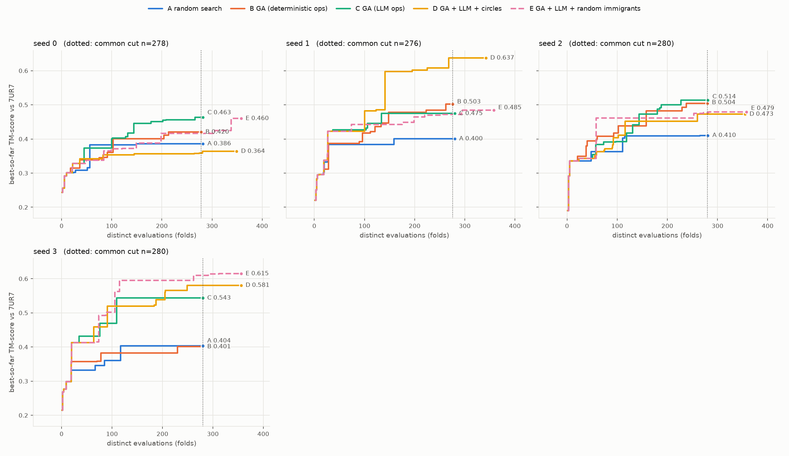

# Sequence-mode search comparison: random search vs GA vs GA with LLM operators

*Branch `tm-score-fitness`. Produced unattended, 2026-09-18 22:55 to 2026-09-19 05:30. Every table and the chart are generated from the raw
files in `results/raw/` by `experiments/summarize_sequence_ga_comparison.py`; nothing in the tables is typed by hand. Figures quoted in the prose are
computed from the same files or read off those tables. This file is
new and `PHASE3_RESULTS.md` is untouched. Fitness is the TM-score of the ESMFold-predicted structure against 7UR7 chain A (63 residues),
normalised by the reference length, from `esmfold/tm_fitness.py`. Reference-sequence TM against itself is 0.9137.*

## 1. The plain statement

Five seeds (0-4), three arms, 15 runs, all completed, no crashes, no retries. Every arm's budget is the same measure: **275-282 distinct folds**, and each comparison below is made at exactly equal distinct-evaluation budget.

| arm | mean final best TM over 5 seeds | range over seeds |
|---|---|---|
| A random search | 0.4002 | 0.3859 – 0.4104 |
| B GA, deterministic operators | 0.4630 | 0.4007 – 0.5040 |
| C GA, LLM operators (mutate=position, crossover=segment) | 0.4864 | 0.4370 – 0.5434 |

The rule for "beats" was fixed before any result was read: X beats Y only if X is higher in **every** seed compared. With 5 seeds the
smallest two-sided sign-test p-value that can be reached is 0.0625, so no comparison here can be called statistically significant at 0.05.

- **Does B beat A? No, not under that rule.** **NO DEMONSTRATED DIFFERENCE between B and A: B higher in 4, lower in 1, tied in 0 of 5 seeds.** Higher in 4 of 5 seeds; mean difference +0.0627 (range -0.0028 to +0.1021). B is above A in seeds 0, 1, 2 and 4; in seed 3 A is
  higher by 0.0028 (B 0.4007, A 0.4035), which is a wash, but it means B did not win every seed.
- **Does C beat A? Yes, under that rule, and it is not significant.** **C BEATS A under the pre-set rule (higher in all 5 of 5 seeds).** Higher in 5 of 5 seeds; mean difference +0.0862 (range +0.0361 to +0.1399). C is above A in all 5 seeds; with 5 seeds the
  smallest p possible is 0.0625.
- **Does C beat B? No.** **NO DEMONSTRATED DIFFERENCE between C and B: C higher in 3, lower in 2, tied in 0 of 5 seeds.** Higher in 3 of 5 seeds; mean difference +0.0234 (range -0.0502 to +0.1427). C is ahead in seeds 0, 2 and 3 (seed 3 by 0.1427) and behind in seeds 1 and 4. The data show no difference
  between LLM operators and deterministic operators that this design can detect.

What these comparisons do **not** show. All three arms end far from the reference. Final best TM ranges 0.386-0.543; only
2 of 5 B runs and 2 of 5 C runs finish above 0.5 (the usual same-fold threshold), and no A run does. The final best genomes are
52-67 edits from the 63-residue reference sequence (edit distance; section 5), i.e. essentially unrelated sequences: the search is finding
sequences that ESMFold folds a little more like 7UR7, not sequences near it.

## 2. What is compared

| | A random search | B GA, deterministic | C GA, LLM operators |
|---|---|---|---|
| how genomes arise | uniform random, drawn as `random_population` draws them | selection + deterministic crossover/mutation | selection + LLM crossover (`segment`) and mutate (`position`) |
| population / generations | - | 16 / 20 | 16 / 20 |
| budget | up to the larger distinct-evaluation count of B and C for the same seed | ~275-282 distinct folds (elites and repeats are cache hits) | ~280-282 distinct folds |

Everything else is at `HPGAConfig` defaults, identical in B and C: crossover rate 0.9, mutation rate 0.05, tournament size 3, elitism 2, length bounds [30, 80].
LLM: `gemma4:12b`, temperature 0.7, default retries. "20 generations" means 20 evaluated populations (generation 0 is the random start), so 19 breeding steps,
which is what `Island.run` means by `n_generations`. For a given seed, **B, C and the first 16 draws of A share the same generation-0 population** (same seed, same draw order), so the
curves coincide for the first 16 evaluations and differ only afterwards. Fitness is deterministic, so a genome scored again is served from a per-run cache; "distinct evaluations" counts folds
actually run and "cache hits" counts re-uses, reported separately in section 1 of the tables.


*Best-so-far TM-score against distinct evaluations, one panel per seed (never pooled). The three arms overlap for the first 16 evaluations by construction.*

## 3. Results

### 1. Runs

| seed | arm | distinct evaluations | cache hits | final best TM | final best length | edit distance to reference | attempt |
|---|---|---|---|---|---|---|---|
| 0 | A random search | 282 | 0 | 0.3859 | 50 | 55 | 1 |
| 0 | B GA (deterministic ops) | 278 | 42 | 0.4203 | 59 | 55 | 1 |
| 0 | C GA (LLM ops) | 282 | 38 | 0.4632 | 59 | 54 | 1 |
| 1 | A random search | 280 | 0 | 0.4004 | 79 | 67 | 1 |
| 1 | B GA (deterministic ops) | 276 | 44 | 0.5025 | 64 | 55 | 1 |
| 1 | C GA (LLM ops) | 280 | 40 | 0.4745 | 62 | 54 | 1 |
| 2 | A random search | 281 | 0 | 0.4104 | 66 | 58 | 1 |
| 2 | B GA (deterministic ops) | 280 | 40 | 0.5040 | 72 | 56 | 1 |
| 2 | C GA (LLM ops) | 281 | 39 | 0.5138 | 72 | 59 | 1 |
| 3 | A random search | 280 | 0 | 0.4035 | 59 | 55 | 1 |
| 3 | B GA (deterministic ops) | 280 | 40 | 0.4007 | 70 | 63 | 1 |
| 3 | C GA (LLM ops) | 280 | 40 | 0.5434 | 57 | 52 | 1 |
| 4 | A random search | 280 | 0 | 0.4009 | 62 | 55 | 1 |
| 4 | B GA (deterministic ops) | 275 | 45 | 0.4873 | 62 | 59 | 1 |
| 4 | C GA (LLM ops) | 280 | 40 | 0.4370 | 69 | 59 | 1 |

### 2. Best-so-far TM-score vs distinct evaluations (per seed, never pooled)

**Seed 0**

| distinct evaluations | A random search | B GA (deterministic ops) | C GA (LLM ops) |
|---|---|---|---|
| 16 | 0.3006 | 0.3006 | 0.3006 |
| 32 | 0.3081 | 0.3150 | 0.3287 |
| 64 | 0.3824 | 0.3392 | 0.3734 |
| 96 | 0.3824 | 0.3605 | 0.3734 |
| 128 | 0.3824 | 0.4003 | 0.4072 |
| 160 | 0.3859 | 0.4003 | 0.4454 |
| 192 | 0.3859 | 0.4003 | 0.4504 |
| 224 | 0.3859 | 0.4203 | 0.4560 |
| 256 | 0.3859 | 0.4203 | 0.4560 |
| own final (n) | 0.3859 (282) | 0.4203 (278) | 0.4632 (282) |

**Seed 1**

| distinct evaluations | A random search | B GA (deterministic ops) | C GA (LLM ops) |
|---|---|---|---|
| 16 | 0.2959 | 0.2959 | 0.2959 |
| 32 | 0.3838 | 0.3871 | 0.4227 |
| 64 | 0.3838 | 0.3871 | 0.4272 |
| 96 | 0.3838 | 0.4170 | 0.4272 |
| 128 | 0.3838 | 0.4367 | 0.4457 |
| 160 | 0.4004 | 0.4782 | 0.4745 |
| 192 | 0.4004 | 0.4782 | 0.4745 |
| 224 | 0.4004 | 0.4843 | 0.4745 |
| 256 | 0.4004 | 0.4843 | 0.4745 |
| own final (n) | 0.4004 (280) | 0.5025 (276) | 0.4745 (280) |

**Seed 2**

| distinct evaluations | A random search | B GA (deterministic ops) | C GA (LLM ops) |
|---|---|---|---|
| 16 | 0.3353 | 0.3353 | 0.3353 |
| 32 | 0.3353 | 0.3492 | 0.3433 |
| 64 | 0.3629 | 0.4074 | 0.3833 |
| 96 | 0.3629 | 0.4175 | 0.3908 |
| 128 | 0.4094 | 0.4386 | 0.4174 |
| 160 | 0.4094 | 0.4821 | 0.4732 |
| 192 | 0.4094 | 0.4821 | 0.5004 |
| 224 | 0.4094 | 0.4821 | 0.5004 |
| 256 | 0.4094 | 0.5040 | 0.5138 |
| own final (n) | 0.4104 (281) | 0.5040 (280) | 0.5138 (281) |

**Seed 3**

| distinct evaluations | A random search | B GA (deterministic ops) | C GA (LLM ops) |
|---|---|---|---|
| 16 | 0.2983 | 0.2983 | 0.2983 |
| 32 | 0.3320 | 0.3572 | 0.4124 |
| 64 | 0.3320 | 0.3572 | 0.4319 |
| 96 | 0.3605 | 0.3820 | 0.4696 |
| 128 | 0.4035 | 0.3820 | 0.5434 |
| 160 | 0.4035 | 0.3820 | 0.5434 |
| 192 | 0.4035 | 0.3820 | 0.5434 |
| 224 | 0.4035 | 0.3820 | 0.5434 |
| 256 | 0.4035 | 0.4007 | 0.5434 |
| own final (n) | 0.4035 (280) | 0.4007 (280) | 0.5434 (280) |

**Seed 4**

| distinct evaluations | A random search | B GA (deterministic ops) | C GA (LLM ops) |
|---|---|---|---|
| 16 | 0.3447 | 0.3447 | 0.3447 |
| 32 | 0.3447 | 0.3727 | 0.3777 |
| 64 | 0.3756 | 0.4080 | 0.3777 |
| 96 | 0.4009 | 0.4263 | 0.4104 |
| 128 | 0.4009 | 0.4506 | 0.4104 |
| 160 | 0.4009 | 0.4691 | 0.4104 |
| 192 | 0.4009 | 0.4835 | 0.4104 |
| 224 | 0.4009 | 0.4873 | 0.4370 |
| 256 | 0.4009 | 0.4873 | 0.4370 |
| own final (n) | 0.4009 (280) | 0.4873 (275) | 0.4370 (280) |

### 3. Final best per seed; then mean and range over seeds

| arm | seed 0 | seed 1 | seed 2 | seed 3 | seed 4 |
|---|---|---|---|---|---|
| A random search (own budget) | 0.3859 | 0.4004 | 0.4104 | 0.4035 | 0.4009 |
| B GA (deterministic ops) (own budget) | 0.4203 | 0.5025 | 0.5040 | 0.4007 | 0.4873 |
| C GA (LLM ops) (own budget) | 0.4632 | 0.4745 | 0.5138 | 0.5434 | 0.4370 |
| A read at B's distinct-evaluation count | 0.3859 | 0.4004 | 0.4104 | 0.4035 | 0.4009 |
| A read at C's distinct-evaluation count | 0.3859 | 0.4004 | 0.4104 | 0.4035 | 0.4009 |

Cross-seed summary (the only pooled table; n = number of seeds that finished):

| arm | n seeds | mean final best | range (min – max) |
|---|---|---|---|
| A (own budget) | 5 | 0.4002 | 0.3859 – 0.4104 |
| A at B's budget | 5 | 0.4002 | 0.3859 – 0.4104 |
| A at C's budget | 5 | 0.4002 | 0.3859 – 0.4104 |
| B | 5 | 0.4630 | 0.4007 – 0.5040 |
| C | 5 | 0.4864 | 0.4370 – 0.5434 |

### 4. Mean pairwise edit distance within the population, per generation

| gen | B s0 | B s1 | B s2 | B s3 | B s4 | C s0 | C s1 | C s2 | C s3 | C s4 |
|---|---|---|---|---|---|---|---|---|---|---|
| 0 | 50.3 | 50.5 | 53.0 | 53.9 | 52.2 | 50.3 | 50.5 | 53.0 | 53.9 | 52.2 |
| 1 | 42.0 | 52.1 | 51.3 | 52.5 | 47.8 | 42.4 | 49.6 | 54.6 | 51.0 | 50.9 |
| 2 | 40.9 | 47.2 | 32.5 | 41.8 | 47.0 | 38.9 | 50.5 | 47.7 | 47.1 | 48.8 |
| 3 | 38.2 | 44.4 | 24.4 | 35.9 | 45.9 | 26.4 | 38.2 | 40.9 | 30.3 | 44.7 |
| 4 | 31.1 | 46.1 | 24.0 | 37.8 | 34.2 | 27.5 | 37.4 | 25.1 | 14.1 | 36.8 |
| 5 | 18.6 | 37.8 | 18.7 | 37.8 | 33.9 | 28.5 | 33.7 | 19.2 | 11.7 | 28.6 |
| 6 | 14.3 | 20.1 | 18.7 | 36.8 | 28.4 | 28.8 | 24.3 | 15.5 | 10.7 | 27.5 |
| 7 | 14.8 | 17.4 | 26.6 | 34.5 | 20.9 | 21.1 | 19.6 | 10.4 | 10.5 | 27.2 |
| 8 | 15.5 | 15.1 | 23.9 | 27.5 | 22.7 | 18.3 | 18.3 | 9.4 | 11.0 | 27.1 |
| 9 | 14.2 | 14.1 | 28.9 | 26.6 | 18.6 | 17.1 | 18.4 | 12.1 | 10.7 | 27.5 |
| 10 | 15.8 | 13.7 | 25.0 | 20.2 | 17.7 | 10.0 | 20.0 | 10.7 | 10.5 | 27.7 |
| 11 | 14.1 | 14.5 | 24.1 | 16.6 | 9.8 | 9.2 | 19.2 | 10.5 | 9.0 | 26.5 |
| 12 | 16.8 | 16.5 | 30.2 | 18.1 | 9.2 | 8.0 | 20.3 | 10.8 | 7.6 | 26.2 |
| 13 | 14.4 | 16.3 | 33.4 | 21.2 | 10.5 | 7.5 | 18.3 | 10.4 | 7.2 | 23.1 |
| 14 | 18.4 | 17.0 | 35.2 | 17.7 | 14.4 | 7.5 | 18.6 | 11.1 | 7.0 | 15.8 |
| 15 | 18.4 | 15.1 | 33.3 | 20.2 | 13.4 | 9.0 | 20.1 | 11.8 | 6.7 | 9.6 |
| 16 | 17.6 | 17.9 | 21.8 | 19.1 | 14.5 | 8.1 | 18.5 | 12.9 | 6.2 | 9.8 |
| 17 | 14.6 | 14.3 | 19.0 | 13.3 | 13.9 | 8.1 | 18.2 | 13.8 | 7.2 | 8.9 |
| 18 | 14.4 | 17.6 | 15.4 | 11.8 | 12.9 | 8.0 | 12.4 | 10.7 | 8.1 | 9.1 |
| 19 | 17.0 | 14.0 | 16.8 | 12.1 | 15.1 | 7.7 | 10.9 | 8.8 | 6.5 | 10.2 |

Distinct genomes in the population (of 16), same columns:

| gen | B s0 | B s1 | B s2 | B s3 | B s4 | C s0 | C s1 | C s2 | C s3 | C s4 |
|---|---|---|---|---|---|---|---|---|---|---|
| 0 | 16 | 16 | 16 | 16 | 16 | 16 | 16 | 16 | 16 | 16 |
| 1 | 16 | 16 | 16 | 16 | 16 | 16 | 16 | 16 | 16 | 16 |
| 2 | 15 | 16 | 16 | 15 | 16 | 16 | 16 | 16 | 16 | 16 |
| 3 | 15 | 16 | 16 | 16 | 16 | 16 | 16 | 16 | 16 | 16 |
| 4 | 15 | 16 | 16 | 16 | 16 | 16 | 16 | 16 | 16 | 16 |
| 5 | 14 | 16 | 16 | 16 | 16 | 16 | 16 | 15 | 16 | 16 |
| 6 | 16 | 16 | 16 | 16 | 16 | 16 | 16 | 15 | 16 | 16 |
| 7 | 16 | 16 | 16 | 16 | 16 | 16 | 16 | 16 | 16 | 16 |
| 8 | 16 | 16 | 16 | 16 | 16 | 16 | 16 | 16 | 15 | 16 |
| 9 | 16 | 16 | 16 | 16 | 16 | 16 | 16 | 16 | 16 | 16 |
| 10 | 16 | 16 | 16 | 16 | 16 | 16 | 16 | 16 | 16 | 16 |
| 11 | 16 | 16 | 16 | 16 | 16 | 16 | 16 | 16 | 16 | 16 |
| 12 | 16 | 16 | 16 | 16 | 16 | 16 | 16 | 16 | 16 | 16 |
| 13 | 16 | 16 | 16 | 16 | 16 | 16 | 16 | 16 | 16 | 16 |
| 14 | 16 | 14 | 16 | 16 | 16 | 16 | 16 | 16 | 16 | 16 |
| 15 | 16 | 15 | 16 | 16 | 16 | 16 | 15 | 16 | 16 | 16 |
| 16 | 16 | 15 | 16 | 16 | 16 | 16 | 16 | 16 | 16 | 16 |
| 17 | 15 | 16 | 16 | 16 | 16 | 16 | 16 | 16 | 16 | 16 |
| 18 | 16 | 16 | 15 | 16 | 15 | 16 | 16 | 16 | 16 | 16 |
| 19 | 16 | 16 | 15 | 15 | 15 | 16 | 16 | 16 | 16 | 16 |

### 5. Final best genomes and their edit distance to the reference sequence

| seed | arm | TM | length | edit distance to reference (63 aa) |
|---|---|---|---|---|
| 0 | A random search | 0.3859 | 50 | 55 |
| 0 | B GA (deterministic ops) | 0.4203 | 59 | 55 |
| 0 | C GA (LLM ops) | 0.4632 | 59 | 54 |
| 1 | A random search | 0.4004 | 79 | 67 |
| 1 | B GA (deterministic ops) | 0.5025 | 64 | 55 |
| 1 | C GA (LLM ops) | 0.4745 | 62 | 54 |
| 2 | A random search | 0.4104 | 66 | 58 |
| 2 | B GA (deterministic ops) | 0.5040 | 72 | 56 |
| 2 | C GA (LLM ops) | 0.5138 | 72 | 59 |
| 3 | A random search | 0.4035 | 59 | 55 |
| 3 | B GA (deterministic ops) | 0.4007 | 70 | 63 |
| 3 | C GA (LLM ops) | 0.5434 | 57 | 52 |
| 4 | A random search | 0.4009 | 62 | 55 |
| 4 | B GA (deterministic ops) | 0.4873 | 62 | 59 |
| 4 | C GA (LLM ops) | 0.4370 | 69 | 59 |

```
seed 0 A: IKRGQHVTVRGSFSSVNYTCHGDMPSPYTPCWMFGKGWGREYNYYIVYPM
seed 0 B: CSKKFVALYAVVKFISNCLNGYFLPQANSHYGIFIQWQCPWQCGRDKGNWSVIKCRCQN
seed 0 C: LASETGARDMGVVFIMNYLNWYFAYKMGITVCHKGFNWCYSGQNVRHPWLAFFKMMNDM
seed 1 A: GCMAMGFNIWCQGMWHISLKWTTWTSIGDWIRFPGAECCVCYSRASKLKPSEDLPQHITFDLHENKFINNGEEHLIDCM
seed 1 B: LPWMIPSCDTDWLIKQVYWADGTVDKKDSYTEITKDGTNWTVCGLVMNYIDEPGELYMIKSIAY
seed 1 C: RDGSVPLCMGEWFIMQVYWYDIIAIKDHTHIMKDDTNRTVHGLVKWYIPVGGSKYMIKYIAY
seed 2 A: PMCMFSPDKHSFFAHYGGGQMIIVWFITTVGKSYSTVIPSTGCWEHWWGPWVTPFQPPAIILHHLY
seed 2 B: WEARSTWTSTQFMKKYYQVSCCCLGGERITCIIRDKDWILYQKQKFYQCPMGITDVEAIGAEHEVRERVPLH
seed 2 C: MEDRVTWPSTSMYKKGQAVFGKCLGNERITGIISDGDWIYRNKQKMAFCPQGETDIEEKGGEHATRRLVPHH
seed 3 A: KKSQCTLRQGDDWTLWEVKNRLHVFHGHAMHEFQAPSGCSVFNDNPPNKGWTFTWSIHS
seed 3 B: RMQCCIPCPSEVFWDMWVWGYWTKHSMKSPHGWNIMSFQNYHRWVASDPCRIILHKIHKFGYCKGCMGQP
seed 3 C: NYLSGWCANKGLWYRTNGMNYHKWWTKSPEQWFLTIKIMGQTEYMVIRGDMHWRKIE
seed 4 A: GQEGDIENWLCVVCYWQGGYMFGGWVLIFEITGPPEQASGKYPLWDNIHNQYWNQCFFIKVL
seed 4 B: IWFYCFGYRWHLEEMLWYFDGAGVKNWMMWYNGRYMEFDRADMYFKCYMVSRVWIMSPCHTN
seed 4 C: MAGEKALQRGIMVIDSRKTVTMFHDGHNRKNWKEPGIVCHGYMVSMGADCYWSVKYFCNDTALNDDVRP
```

### 6. Wall time split (seconds; percentages of that run's wall time)

| seed | arm | wall | fitness (folds) | LLM calls | GPU swap (C only) | everything else | s per distinct fold |
|---|---|---|---|---|---|---|---|
| 0 | A random search | 641 | 641 (100.0%) | 0 (0.0%) | 0 (0.0%) | 0.0 (0.00%) | 2.27 |
| 0 | B GA (deterministic ops) | 585 | 583 (99.5%) | 0 (0.0%) | 0 (0.0%) | 2.7 (0.46%) | 2.10 |
| 0 | C GA (LLM ops) | 2875 | 614 (21.3%) | 1950 (67.8%) | 298 (10.4%) | 13.7 (0.48%) | 2.18 |
| 1 | A random search | 658 | 658 (100.0%) | 0 (0.0%) | 0 (0.0%) | 0.0 (0.00%) | 2.35 |
| 1 | B GA (deterministic ops) | 683 | 681 (99.6%) | 0 (0.0%) | 0 (0.0%) | 2.7 (0.39%) | 2.47 |
| 1 | C GA (LLM ops) | 3013 | 654 (21.7%) | 2056 (68.2%) | 291 (9.7%) | 11.5 (0.38%) | 2.34 |
| 2 | A random search | 689 | 689 (100.0%) | 0 (0.0%) | 0 (0.0%) | 0.0 (0.00%) | 2.45 |
| 2 | B GA (deterministic ops) | 937 | 933 (99.6%) | 0 (0.0%) | 0 (0.0%) | 3.6 (0.39%) | 3.33 |
| 2 | C GA (LLM ops) | 3859 | 909 (23.5%) | 2664 (69.0%) | 276 (7.1%) | 11.2 (0.29%) | 3.23 |
| 3 | A random search | 614 | 614 (100.0%) | 0 (0.0%) | 0 (0.0%) | 0.0 (0.00%) | 2.19 |
| 3 | B GA (deterministic ops) | 762 | 759 (99.6%) | 0 (0.0%) | 0 (0.0%) | 3.1 (0.41%) | 2.71 |
| 3 | C GA (LLM ops) | 3027 | 623 (20.6%) | 2120 (70.0%) | 271 (9.0%) | 13.0 (0.43%) | 2.22 |
| 4 | A random search | 595 | 595 (100.0%) | 0 (0.0%) | 0 (0.0%) | 0.0 (0.00%) | 2.13 |
| 4 | B GA (deterministic ops) | 612 | 609 (99.6%) | 0 (0.0%) | 0 (0.0%) | 2.5 (0.41%) | 2.22 |
| 4 | C GA (LLM ops) | 3318 | 839 (25.3%) | 2218 (66.9%) | 247 (7.4%) | 13.7 (0.41%) | 3.00 |

LLM time is time inside the two operator wrappers: retries and the Ollama model reload that follows each swap are included. "Everything else" is selection/crossover/mutation bookkeeping, diversity metrics and logging.

### 7. Arm C: fallback rate and requests per call

| seed | operator | operator calls | gated off (crossover rate) | LLM calls | fell back | fallback rate | requests / LLM call | retries |
|---|---|---|---|---|---|---|---|---|
| 0 | mutate (position) | 266 | 0 | 266 | 0 | 0.000 | 1.034 | 9 |
| 0 | crossover (segment) | 133 | 9 | 124 | 0 | 0.000 | 1.000 | 0 |
| 0 | both |  |  | 390 | 0 | 0.000 | 1.023 |  |
| 1 | mutate (position) | 266 | 0 | 266 | 0 | 0.000 | 1.011 | 3 |
| 1 | crossover (segment) | 133 | 9 | 124 | 0 | 0.000 | 1.000 | 0 |
| 1 | both |  |  | 390 | 0 | 0.000 | 1.008 |  |
| 2 | mutate (position) | 266 | 0 | 266 | 0 | 0.000 | 1.105 | 28 |
| 2 | crossover (segment) | 133 | 16 | 117 | 0 | 0.000 | 1.000 | 0 |
| 2 | both |  |  | 383 | 0 | 0.000 | 1.073 |  |
| 3 | mutate (position) | 266 | 0 | 266 | 1 | 0.004 | 1.064 | 18 |
| 3 | crossover (segment) | 133 | 10 | 123 | 0 | 0.000 | 1.000 | 0 |
| 3 | both |  |  | 389 | 1 | 0.003 | 1.044 |  |
| 4 | mutate (position) | 266 | 0 | 266 | 0 | 0.000 | 1.056 | 15 |
| 4 | crossover (segment) | 133 | 11 | 122 | 0 | 0.000 | 1.000 | 0 |
| 4 | both |  |  | 388 | 0 | 0.000 | 1.039 |  |

Fallback rate = fell back / LLM calls (a crossover the 0.9 rate gate skipped never reaches the LLM and is excluded); requests / LLM call is 1.0 when every call succeeded first time.

Stage-1 gate (one generation, pop 16, seed 0): fallback rate by operator {'mutate': 0.0, 'crossover': 0.0}; LLM calls {'mutate': 14, 'crossover': 7}.

### 8. Comparisons at equal distinct-evaluation budget

**B vs A**

| seed | budget n | B best@n | A best@n | difference | higher |
|---|---|---|---|---|---|
| 0 | 278 | 0.4203 | 0.3859 | +0.0343 | B |
| 1 | 276 | 0.5025 | 0.4004 | +0.1021 | B |
| 2 | 280 | 0.5040 | 0.4104 | +0.0936 | B |
| 3 | 280 | 0.4007 | 0.4035 | -0.0028 | A |
| 4 | 275 | 0.4873 | 0.4009 | +0.0864 | B |

Mean difference +0.0627 (range -0.0028 to +0.1021). **NO DEMONSTRATED DIFFERENCE between B and A: B higher in 4, lower in 1, tied in 0 of 5 seeds.** Smallest two-sided sign-test p possible with 5 seeds: 0.0625.

**C vs A**

| seed | budget n | C best@n | A best@n | difference | higher |
|---|---|---|---|---|---|
| 0 | 282 | 0.4632 | 0.3859 | +0.0773 | C |
| 1 | 280 | 0.4745 | 0.4004 | +0.0741 | C |
| 2 | 281 | 0.5138 | 0.4104 | +0.1034 | C |
| 3 | 280 | 0.5434 | 0.4035 | +0.1399 | C |
| 4 | 280 | 0.4370 | 0.4009 | +0.0361 | C |

Mean difference +0.0862 (range +0.0361 to +0.1399). **C BEATS A under the pre-set rule (higher in all 5 of 5 seeds).** Smallest two-sided sign-test p possible with 5 seeds: 0.0625.

**C vs B**

| seed | budget n | C best@n | B best@n | difference | higher |
|---|---|---|---|---|---|
| 0 | 278 | 0.4632 | 0.4203 | +0.0430 | C |
| 1 | 276 | 0.4745 | 0.5025 | -0.0280 | B |
| 2 | 280 | 0.5138 | 0.5040 | +0.0098 | C |
| 3 | 280 | 0.5434 | 0.4007 | +0.1427 | C |
| 4 | 275 | 0.4370 | 0.4873 | -0.0502 | B |

Mean difference +0.0234 (range -0.0502 to +0.1427). **NO DEMONSTRATED DIFFERENCE between C and B: C higher in 3, lower in 2, tied in 0 of 5 seeds.** Smallest two-sided sign-test p possible with 5 seeds: 0.0625.

### 9. What the LLM operators did inside arm C (from the per-call logs; accepted, i.e. valid, responses only)

| seed | mutate calls | positions changed | distinct position indices | most-used index (share) | distinct new letters (of 20) | most-used letter (share) | crossover calls | distinct cut values | cut values (count) |
|---|---|---|---|---|---|---|---|---|---|
| 0 | 266 | 792 | 28 | 10 (12%) | 18 | G (21%) | 124 | 2 | 40: 107, 50: 17 |
| 1 | 266 | 804 | 26 | 3 (17%) | 19 | G (19%) | 124 | 2 | 40: 118, 50: 6 |
| 2 | 266 | 1032 | 41 | 10 (12%) | 19 | L (18%) | 117 | 2 | 40: 109, 50: 8 |
| 3 | 265 | 798 | 28 | 40 (12%) | 18 | G (19%) | 123 | 2 | 40: 104, 50: 19 |
| 4 | 266 | 882 | 33 | 10 (13%) | 19 | G (17%) | 122 | 2 | 40: 108, 50: 14 |


## 4. Reading the results

- **Both GA arms were above random search in most seeds; the LLM arm in all five.** C's mean margin over A is +0.0862; B's is +0.0627, pulled down by seed 3 where B's run stalled at
  0.38-0.40 while A reached 0.4035.
- **C and B are not distinguishable.** C has the higher mean (0.4864 vs 0.4630, difference +0.0234) but the sign flips between seeds and the seed-to-seed spread (range 0.4370 – 0.5434 for C, 0.4007 – 0.5040 for B)
  is larger than that difference. Seed 3's +0.1427 is larger than the sum of all five differences (+0.1172); leaving seed 3 out, C's mean difference from B is
  -0.0064, i.e. slightly behind.
- **Population diversity.** Mean pairwise edit distance starts at 50-54 in every run (same generation 0 for B and C). At generation 19 it is 15.0 on average for B
  (17.0, 14.0, 16.8, 12.1, 15.1) and 8.8 for C (7.7, 10.9, 8.8, 6.5, 10.2); C is lower than B in all five seeds. Both arms
  collapse from ~50 to the low tens and C ends lower. The timing differs by seed rather than following one pattern: in seeds 2 and 3 C is at ~10 by generation 7 while B is still at 25-35; in seed 4 it is the reverse
  (B near 10 by generation 11, C near 27 until generation 13); in seed 0 B reaches ~14 by generation 6 and C only ~10 by generation 10 (section 4 of the tables).
- **The LLM operators reach a small part of their space inside the GA too.** Crossover (section 9 of the tables): every accepted `segment` crossover in every seed used one of only **two cut values, 40 and 50**
  (40 in 85%-95% of them), out of 99 possible. This is the behaviour `PHASE3_RESULTS.md` section 9 measured in isolation, reproduced inside the loop. Mutation used 26-41 distinct position indices
  and 17-21% of its letters were the single most common one (G or L). C still finished above A in every seed with operators this restricted, and it does not finish reliably above B.
  This comparison does not say why C beats A, only that it does.
- **Cost.** C's wall time is 4.0-5.4x B's (2875-3859 s vs 585-937 s). In C, on average 22% of wall time is folds, 68% LLM calls, 9% moving ESMFold
  and Ollama on and off the GPU, and 0.4% everything else; for A and B, folds are 99.5-100%. All comparisons here are at equal distinct folds, not equal wall time.
- **LLM reliability.** Over the five C runs: 1940 LLM calls, 1 fell back to the deterministic operator (0.05%), 1.037 requests per call (the excess is retries of `position` mutate; `segment` crossover needed none).
  The stage-1 gate (one generation) was 0 of 14 mutate and 0 of 7 crossover calls, a small sample.

## 5. Limits of this experiment

- Five seeds. The fitness noise between seeds (e.g. arm C 0.437-0.543) is comparable to the differences between arms. No comparison can be significant at 0.05 with 5 seeds.
- One reference, one model (`gemma4:12b`), one temperature, one population size. Nothing here generalises beyond that.
- B's and C's improvement over A cannot be attributed to any specific operator; there is no ablation of selection, of crossover, or of mutation separately.
- Budget is distinct folds. That is the fair measure of search effort in evaluations, and it hides that C costs about five times the wall time of B.
- The 0.9137 self-fold score means even the native sequence does not score 1.0; the ceiling for any arm is that, not 1.

## 6. Decisions I made on my own while you were away

Ambiguous points were resolved toward the more conservative reading. In the order they came up:

1. **Split commit `73763c5` into a code-only commit (`931f9d2`) and held its three results files back.** It mixed code with results and you said never to push results commits; pushing any later commit would have published it. The results files stayed untracked until the final results commit.
2. **Pushed code commits only.** Pushed: `931f9d2`, `5591dc0` (driver), `b14ad7d` (summariser), `c6fd7ee` (stage-3 launcher), `fc5ef39`, `12b69e2` (summariser edits). The results commit that contains this report is not pushed. Nothing merged into `main`.
3. **Put the fitness cache in a new driver, not in `run_sequence_ga_smoke.py`,** so that script's behaviour (which backs earlier results) is unchanged. The cache is per run and never shared across arms or runs, so wall times are comparable.
4. **"20 generations" = 20 evaluated populations** (19 breeding steps), as `Island.run` and the earlier smoke run use it.
5. **Arm A's budget:** the larger distinct-evaluation count of B and C for the same seed; A draws exactly as `random_population` does, so its first 16 draws equal the GA arms' generation 0.
6. **Fixed the comparison rule before reading results:** equal distinct-evaluation budget (n = smaller of the two arms' counts, A read off its curve), and "X beats Y" only if strictly higher in every seed. Later I changed only the *wording* of the verdicts (added "under the pre-set rule", the seed count, and a "not interpretable" flag for fewer than 3 seeds); the rule was not changed.
7. **Mutate=`position` and crossover=`segment` set per call** by wrapping the two operator entry points inside the driver, because one `HPGA_LLM_PROMPT_STYLE` value cannot name both for the sequence model (`best` is not implemented there). No file in `hpga/` changed for this.
8. **GPU coexistence.** ESMFold (~13.7 GB) and gemma4:12b (~8 GB) do not fit together on the 15 GB T4, which the brief did not anticipate. In arm C the driver unloads Ollama through its API (`keep_alive=0`, a documented call, not a kill; it is this user's own server) before folding, and moves ESMFold to CPU RAM before LLM calls. Swap time is reported separately; the Ollama reload lands in the first LLM call of each breeding step and is counted as LLM time. After swaps a cached genome was re-folded (generations 1, 6, 11, 16 of every C run, 20 checks) and gave the identical number every time.
9. **Stage-1b fallback rate** = fell back / LLM calls, excluding crossovers the 0.9 rate gate skipped (the higher-rate, more conservative denominator). Both were 0, so arm C ran. The gate sample was 14 mutate and 7 crossover calls.
10. **Ran stage 3 (seeds 3 and 4)** through a detached launcher with a written rule: launch iff stage 2 ended normally and now + 2 x (mean stage-2 seconds per seed) + 40 min <= 06:55 (8 hours after the task began at 22:55). The rule evaluated true at 02:58 (projected 06:13) and stage 3 ran.
11. **Parity check used `--baseline 50de6f8`** as instructed: 0 divergences in `self`, `check` and `active`, all 10 mutants detected (`results/raw/sequence_ga_stage1_checks.txt`). Protected files untouched and no existing experiment script modified.
12. **Added things not asked for:** the stage-3 launcher; the report's section 9 (what the LLM operators did inside arm C); a distinct-genomes-per-generation table; a `sequence_ga_llm_check` gate script mode; a `--out-dir` option in the driver for testing. A test run of all three arms (pop 4, 3 generations) was done in a scratch directory and is not part of the results.
13. **Kept all model settings at defaults** (temperature 0.7, LLM retries 2, request timeout 120 s); did not exclude cold-start effects from any timing.
14. **Fixed two bugs before launching stage 2:** arm A's timing window excluded its GPU setup while subtracting it (a -0.04 s "other" time), and the GPU-busy check would have mistaken this process's own ESMFold memory for another user's if `nvidia-smi` did not list it.
15. **Chart:** the categorical colours are slots 1-3 of the validated palette (all-pairs safe); the aqua arm is below 3:1 contrast on the light surface, so it carries direct value labels and every number is also in a table. I widened the figure and de-overlapped the end labels after looking at the render.

## 7. Stop conditions and incidents

None triggered. LLM fallback was 0 in the stage-1 gate. The GPU was never in use by anyone else (no waits). Disk stayed at about 412 GB free. No run crashed or needed a retry (every result has `attempt` = 1).

## 8. Files

- Report tables and chart: `results/raw/sequence_ga_report_tables.md`, `results/sequence_ga_best_so_far.png`.
- One result file per (arm, seed): `results/raw/sequence_ga_cmp_{A,B,C}_seed{0..4}.json` (full populations, fitnesses, per-generation records, best-so-far curves, timing, LLM tallies).
- LLM call logs: `results/raw/llm_operator_calls_seqcmp_C_seed*.jsonl` (one per C run) and `..._seqcmp_llmcheck_seed0_*.jsonl`.
- Run logs and status: `results/raw/sequence_ga_comparison_run_seeds012.log`, `..._seeds34.log`, `sequence_ga_comparison_status_seeds012.json`, `sequence_ga_comparison_status.json` (stage 3), `sequence_ga_stage3_chain.log`.
- Stage 1: `sequence_ga_llm_check.json` (+ console log), `sequence_ga_stage1_checks.txt`, and the earlier `sequence_ga_smoke_seed0.json` (+ console log), `sequence_next_generation_checks.txt`.
- Code: `experiments/run_sequence_ga_comparison.py`, `experiments/summarize_sequence_ga_comparison.py`, `experiments/chain_sequence_ga_stage3.py`.

## 9. Circles (arm D) against random immigrants (arm E) and the earlier arms

*Added later, on branch `circles-sequence`. Arms A, B and C are unchanged from sections 1-8 (same result files). Arm D is GA + LLM operators + circles
ported to the sequence genome (`hpga/circles_sequence.py`); arm E is GA + LLM operators + random immigrants, the control. Every table and the chart are generated from the raw files in
`results/raw/` by `experiments/summarize_sequence_ga_circles.py`; figures quoted in the prose are computed from the same files or read off those tables.
**Only 4 of the 5 planned seeds are complete for all five arms (0-3): arm E seed 4 failed twice because Ollama stopped loading its model (section 9.12). Seed 4 is excluded from every comparison; D seed 4 is reported only where a D-only figure is meant.**
The caveats of section 1 apply unchanged: single runs, temperature 0.7, and with 4 seeds the smallest two-sided sign-test p that can be reached is 0.125.*

### 9.0 The plain statement

Best-so-far TM-score read at the same distinct-fold count per seed (the smallest count reached by any of the five arms, 276-280 folds), mean over seeds 0-3:
A random search 0.4001, B GA 0.4569, C GA+LLM 0.4988, **D GA+LLM+circles 0.5123**, E GA+LLM+random immigrants 0.4939. The ranges over seeds are wide
(D 0.3587 - 0.6372, E 0.4164 - 0.6099, C 0.4632 - 0.5434) and much larger than the gaps between the means of C, D and E.

The rule is the one used for A, B and C: X beats Y only if X is higher in **every** seed.

- **Does D beat C? No.** **NO DEMONSTRATED DIFFERENCE between D and C: D higher in 2, lower in 2, tied in 0 of 4 seeds.** Higher in 2 of 4 seeds; mean difference +0.0135 (range -0.1046 to +0.1627); smallest two-sided sign-test p possible with 4 seeds: 0.125. D is far ahead in seed 1 (0.6372 vs 0.4745) and behind by 0.105 in seed 0.
- **Does D beat E? No.** **NO DEMONSTRATED DIFFERENCE between D and E: D higher in 1, lower in 3, tied in 0 of 4 seeds.** Higher in 1 of 4 seeds; mean difference +0.0184 (range -0.0577 to +0.1653); smallest two-sided sign-test p possible with 4 seeds: 0.125. The control is at least as good as circles in three of four seeds.
- **Does E beat C? No.** **NO DEMONSTRATED DIFFERENCE between E and C: E higher in 1, lower in 3, tied in 0 of 4 seeds.** Higher in 1 of 4 seeds; mean difference -0.0049 (range -0.0469 to +0.0665); smallest two-sided sign-test p possible with 4 seeds: 0.125.

**Circles did not demonstrably add anything over plain random injection, or over no injection.** Where D's diversity is higher than C's it did not convert into fitness (section 9.5): both circles and random immigrants raise population diversity, D's is not higher than E's, and neither
beats C consistently. D has the single best result of the whole study (seed 1, 0.6372) and the single worst of the three LLM arms (seed 0, 0.3587); with four seeds that spread cannot be attributed to circles.
2 of 4 D runs, 1 of 4 E runs, 2 of 4 C runs and 2 of 4 B runs end above 0.5 at the cut; no A run does. Every final best genome, in every arm, is 52-67 edits from the 63-residue reference (section 9.9): none of these searches gets near the reference sequence.



*Best-so-far TM-score against distinct evaluations, one panel per complete seed (never pooled). The dotted line is the common cut; D and E ran to 342-358 folds because their injected genomes add folds. Arms share generation 0 per seed, so their curves coincide at the start.*

### 9.1 Runs and the common budget

| seed | arm | distinct folds | cache hits | genomes evaluated (incl. repeats) | final best TM (own budget) | attempt |
|---|---|---|---|---|---|---|
| 0 | D GA + LLM + circles | 349 | 47 | 396 | 0.3639 | 1 |
| 0 | E GA + LLM + random immigrants | 358 | 38 | 396 | 0.4599 | 1 |
| 1 | D GA + LLM + circles | 342 | 54 | 396 | 0.6372 | 1 |
| 1 | E GA + LLM + random immigrants | 358 | 38 | 396 | 0.4848 | 1 |
| 2 | D GA + LLM + circles | 355 | 41 | 396 | 0.4726 | 1 |
| 2 | E GA + LLM + random immigrants | 358 | 38 | 396 | 0.4787 | 1 |
| 3 | D GA + LLM + circles | 356 | 40 | 396 | 0.5807 | 1 |
| 3 | E GA + LLM + random immigrants | 356 | 40 | 396 | 0.6146 | 1 |
| 4 | D GA + LLM + circles | 351 | 45 | 396 | 0.4034 | 1 |
| 4 | E GA + LLM + random immigrants | not completed |  |  |  |  |

Failed after one retry: E seed 4 (httpx.ReadTimeout: timed out)

Seeds with an incomplete set of arms are excluded from the comparisons below: [4].

Distinct folds reached by each arm, and the common cut n_cut (the smallest of the five):

| seed | A | B | C | D | E | n_cut |
|---|---|---|---|---|---|---|
| 0 | 282 | 278 | 282 | 349 | 358 | 278 |
| 1 | 280 | 276 | 280 | 342 | 358 | 276 |
| 2 | 281 | 280 | 281 | 355 | 358 | 280 |
| 3 | 280 | 280 | 280 | 356 | 356 | 280 |

### 9.2 Best TM-score at the common distinct-fold count (per seed), and over seeds

| arm (read at n_cut) | seed 0 (n=278) | seed 1 (n=276) | seed 2 (n=280) | seed 3 (n=280) |
|---|---|---|---|---|
| A random search | 0.3859 | 0.4004 | 0.4104 | 0.4035 |
| B GA (deterministic ops) | 0.4203 | 0.5025 | 0.5040 | 0.4007 |
| C GA (LLM ops) | 0.4632 | 0.4745 | 0.5138 | 0.5434 |
| D GA + LLM + circles | 0.3587 | 0.6372 | 0.4726 | 0.5807 |
| E GA + LLM + random immigrants | 0.4164 | 0.4719 | 0.4773 | 0.6099 |

Each run's own final best over its full budget (D and E ran further than the cut; A, B, C as before):

| arm (full run) | seed 0 | seed 1 | seed 2 | seed 3 |
|---|---|---|---|---|
| A random search | 0.3859 | 0.4004 | 0.4104 | 0.4035 |
| B GA (deterministic ops) | 0.4203 | 0.5025 | 0.5040 | 0.4007 |
| C GA (LLM ops) | 0.4632 | 0.4745 | 0.5138 | 0.5434 |
| D GA + LLM + circles | 0.3639 | 0.6372 | 0.4726 | 0.5807 |
| E GA + LLM + random immigrants | 0.4599 | 0.4848 | 0.4787 | 0.6146 |

Cross-seed summary at the common cut (the only pooled table; n = complete seeds):

| arm | n seeds | mean best-so-far at n_cut | range (min - max) |
|---|---|---|---|
| A random search | 4 | 0.4001 | 0.3859 - 0.4104 |
| B GA (deterministic ops) | 4 | 0.4569 | 0.4007 - 0.5040 |
| C GA (LLM ops) | 4 | 0.4988 | 0.4632 - 0.5434 |
| D GA + LLM + circles | 4 | 0.5123 | 0.3587 - 0.6372 |
| E GA + LLM + random immigrants | 4 | 0.4939 | 0.4164 - 0.6099 |

### 9.3 Mean pairwise edit distance within the evaluated population, per generation (per seed)

The evaluated population is 16 genomes at generation 0 and 20 afterwards for D and E (their 4 injected genomes included), 16 for B and C.

**Seed 0**

| gen | B | C | D | E |
|---|---|---|---|---|
| 0 | 50.3 | 50.3 | 50.3 | 50.3 |
| 1 | 42.0 | 42.4 | 45.7 | 45.8 |
| 2 | 40.9 | 38.9 | 42.9 | 42.7 |
| 3 | 38.2 | 26.4 | 44.1 | 40.2 |
| 4 | 31.1 | 27.5 | 46.6 | 43.1 |
| 5 | 18.6 | 28.5 | 47.3 | 38.2 |
| 6 | 14.3 | 28.8 | 43.2 | 36.0 |
| 7 | 14.8 | 21.1 | 41.2 | 35.9 |
| 8 | 15.5 | 18.3 | 41.0 | 40.1 |
| 9 | 14.2 | 17.1 | 40.2 | 38.4 |
| 10 | 15.8 | 10.0 | 34.2 | 39.6 |
| 11 | 14.1 | 9.2 | 37.2 | 36.5 |
| 12 | 16.8 | 8.0 | 32.3 | 35.5 |
| 13 | 14.4 | 7.5 | 38.6 | 32.6 |
| 14 | 18.4 | 7.5 | 36.7 | 31.0 |
| 15 | 18.4 | 9.0 | 34.5 | 34.9 |
| 16 | 17.6 | 8.1 | 33.4 | 38.1 |
| 17 | 14.6 | 8.1 | 35.0 | 28.7 |
| 18 | 14.4 | 8.0 | 34.0 | 31.2 |
| 19 | 17.0 | 7.7 | 34.9 | 41.1 |

**Seed 1**

| gen | B | C | D | E |
|---|---|---|---|---|
| 0 | 50.5 | 50.5 | 50.5 | 50.5 |
| 1 | 52.1 | 49.6 | 52.5 | 52.5 |
| 2 | 47.2 | 50.5 | 51.5 | 45.6 |
| 3 | 44.4 | 38.2 | 52.2 | 44.7 |
| 4 | 46.1 | 37.4 | 50.1 | 37.4 |
| 5 | 37.8 | 33.7 | 49.1 | 40.0 |
| 6 | 20.1 | 24.3 | 46.3 | 43.6 |
| 7 | 17.4 | 19.6 | 33.5 | 45.8 |
| 8 | 15.1 | 18.3 | 29.8 | 41.7 |
| 9 | 14.1 | 18.4 | 30.3 | 35.9 |
| 10 | 13.7 | 20.0 | 30.6 | 47.1 |
| 11 | 14.5 | 19.2 | 30.6 | 48.8 |
| 12 | 16.5 | 20.3 | 31.1 | 47.4 |
| 13 | 16.3 | 18.3 | 28.1 | 44.2 |
| 14 | 17.0 | 18.6 | 26.1 | 40.4 |
| 15 | 15.1 | 20.1 | 26.6 | 38.9 |
| 16 | 17.9 | 18.5 | 26.8 | 36.9 |
| 17 | 14.3 | 18.2 | 26.4 | 39.5 |
| 18 | 17.6 | 12.4 | 26.3 | 41.9 |
| 19 | 14.0 | 10.9 | 29.6 | 38.0 |

**Seed 2**

| gen | B | C | D | E |
|---|---|---|---|---|
| 0 | 53.0 | 53.0 | 53.0 | 53.0 |
| 1 | 51.3 | 54.6 | 54.7 | 54.7 |
| 2 | 32.5 | 47.7 | 51.3 | 50.0 |
| 3 | 24.4 | 40.9 | 52.5 | 49.5 |
| 4 | 24.0 | 25.1 | 46.9 | 53.6 |
| 5 | 18.7 | 19.2 | 46.0 | 53.0 |
| 6 | 18.7 | 15.5 | 41.3 | 49.7 |
| 7 | 26.6 | 10.4 | 36.6 | 40.4 |
| 8 | 23.9 | 9.4 | 35.5 | 44.4 |
| 9 | 28.9 | 12.1 | 31.1 | 40.6 |
| 10 | 25.0 | 10.7 | 36.3 | 43.7 |
| 11 | 24.1 | 10.5 | 37.7 | 40.3 |
| 12 | 30.2 | 10.8 | 38.1 | 39.2 |
| 13 | 33.4 | 10.4 | 39.3 | 38.5 |
| 14 | 35.2 | 11.1 | 39.4 | 38.1 |
| 15 | 33.3 | 11.8 | 38.0 | 41.6 |
| 16 | 21.8 | 12.9 | 36.8 | 36.9 |
| 17 | 19.0 | 13.8 | 33.3 | 40.4 |
| 18 | 15.4 | 10.7 | 36.1 | 31.7 |
| 19 | 16.8 | 8.8 | 32.0 | 33.0 |

**Seed 3**

| gen | B | C | D | E |
|---|---|---|---|---|
| 0 | 53.9 | 53.9 | 53.9 | 53.9 |
| 1 | 52.5 | 51.0 | 51.6 | 51.6 |
| 2 | 41.8 | 47.1 | 46.3 | 49.5 |
| 3 | 35.9 | 30.3 | 43.8 | 46.4 |
| 4 | 37.8 | 14.1 | 41.8 | 37.6 |
| 5 | 37.8 | 11.7 | 38.3 | 40.4 |
| 6 | 36.8 | 10.7 | 32.5 | 40.2 |
| 7 | 34.5 | 10.5 | 33.7 | 32.2 |
| 8 | 27.5 | 11.0 | 33.4 | 31.5 |
| 9 | 26.6 | 10.7 | 33.3 | 33.0 |
| 10 | 20.2 | 10.5 | 31.5 | 32.2 |
| 11 | 16.6 | 9.0 | 27.0 | 32.0 |
| 12 | 18.1 | 7.6 | 26.0 | 31.0 |
| 13 | 21.2 | 7.2 | 26.4 | 29.5 |
| 14 | 17.7 | 7.0 | 26.4 | 29.1 |
| 15 | 20.2 | 6.7 | 27.4 | 25.6 |
| 16 | 19.1 | 6.2 | 25.1 | 27.6 |
| 17 | 13.3 | 7.2 | 22.3 | 24.2 |
| 18 | 11.8 | 8.1 | 22.6 | 27.7 |
| 19 | 12.1 | 6.5 | 22.2 | 23.6 |

### 9.4 Comparisons at the common budget

**D vs C**

| seed | n_cut | D best@n_cut | C best@n_cut | difference | higher |
|---|---|---|---|---|---|
| 0 | 278 | 0.3587 | 0.4632 | -0.1046 | C |
| 1 | 276 | 0.6372 | 0.4745 | +0.1627 | D |
| 2 | 280 | 0.4726 | 0.5138 | -0.0413 | C |
| 3 | 280 | 0.5807 | 0.5434 | +0.0373 | D |

Mean difference +0.0135 (range -0.1046 to +0.1627). **NO DEMONSTRATED DIFFERENCE between D and C: D higher in 2, lower in 2, tied in 0 of 4 seeds.** Smallest two-sided sign-test p possible with 4 seeds: 0.1250.

**D vs E**

| seed | n_cut | D best@n_cut | E best@n_cut | difference | higher |
|---|---|---|---|---|---|
| 0 | 278 | 0.3587 | 0.4164 | -0.0577 | E |
| 1 | 276 | 0.6372 | 0.4719 | +0.1653 | D |
| 2 | 280 | 0.4726 | 0.4773 | -0.0047 | E |
| 3 | 280 | 0.5807 | 0.6099 | -0.0292 | E |

Mean difference +0.0184 (range -0.0577 to +0.1653). **NO DEMONSTRATED DIFFERENCE between D and E: D higher in 1, lower in 3, tied in 0 of 4 seeds.** Smallest two-sided sign-test p possible with 4 seeds: 0.1250.

**E vs C**

| seed | n_cut | E best@n_cut | C best@n_cut | difference | higher |
|---|---|---|---|---|---|
| 0 | 278 | 0.4164 | 0.4632 | -0.0469 | C |
| 1 | 276 | 0.4719 | 0.4745 | -0.0026 | C |
| 2 | 280 | 0.4773 | 0.5138 | -0.0366 | C |
| 3 | 280 | 0.6099 | 0.5434 | +0.0665 | E |

Mean difference -0.0049 (range -0.0469 to +0.0665). **NO DEMONSTRATED DIFFERENCE between E and C: E higher in 1, lower in 3, tied in 0 of 4 seeds.** Smallest two-sided sign-test p possible with 4 seeds: 0.1250.

### 9.5 Does D's extra diversity, if any, convert into fitness?

| seed | diversity D-C (mean gens 1-19) | D-C (gen 19) | diversity D-E (mean gens 1-19) | D-E (gen 19) | best TM D-C @n_cut | best TM D-E @n_cut |
|---|---|---|---|---|---|---|
| 0 | +21.6 | +27.1 | +1.8 | -6.2 | -0.1046 | -0.0577 |
| 1 | +11.1 | +18.7 | -7.0 | -8.4 | +0.1627 | +0.1653 |
| 2 | +21.9 | +23.2 | -3.0 | -1.0 | -0.0413 | -0.0047 |
| 3 | +17.8 | +15.7 | -1.8 | -1.4 | +0.0373 | -0.0292 |

Diversity differences are in edit-distance units (positive = D more diverse); fitness differences in TM-score at n_cut (positive = D higher). Population diversity is over the evaluated population (16-20 genomes).

### 9.6 The injected genomes themselves (D: circle proposals; E: random immigrants)

| seed | D injected: mean TM | D injected: best | D rest of population: mean | E injected: mean TM | E injected: best | E rest of population: mean |
|---|---|---|---|---|---|---|
| 0 | 0.2732 | 0.3321 | 0.2983 | 0.2480 | 0.4599 | 0.3113 |
| 1 | 0.2706 | 0.3142 | 0.3791 | 0.2552 | 0.4487 | 0.3256 |
| 2 | 0.2493 | 0.3568 | 0.3117 | 0.2569 | 0.3696 | 0.3302 |
| 3 | 0.2538 | 0.3144 | 0.3898 | 0.2514 | 0.3540 | 0.4029 |

Means over generations 1-19 of the last 4 members of each evaluated population (the injected ones) and of the other members.

### 9.7 LLM calls, tokens and wall time (seconds; percentages of that run's wall time)

| seed | arm | LLM calls | requests | tokens in | tokens out | wall | fitness (folds) | LLM calls time | swap between models |   of which Ollama load | everything else |
|---|---|---|---|---|---|---|---|---|---|---|---|
| 0 | C GA (LLM ops) | 390 | 399 | 147,500 | 10,522 | 2875 | 614 (21.3%) | 1950 (67.8%) | 298 (10.4%) | in LLM time | 13.7 (0.48%) |
| 0 | D GA + LLM + circles | 576 | 620 | 250,945 | 19,060 | 4657 | 784 (16.8%) | 3427 (73.6%) | 431 (9.3%) | 185 | 14.8 (0.32%) |
| 0 | E GA + LLM + random immigrants | 383 | 397 | 146,862 | 10,534 | 3139 | 836 (26.6%) | 1827 (58.2%) | 463 (14.8%) | 192 | 11.8 (0.38%) |
| 1 | C GA (LLM ops) | 390 | 393 | 147,446 | 10,464 | 3013 | 654 (21.7%) | 2056 (68.2%) | 291 (9.7%) | in LLM time | 11.5 (0.38%) |
| 1 | D GA + LLM + circles | 577 | 625 | 262,380 | 19,694 | 4909 | 912 (18.6%) | 3511 (71.5%) | 472 (9.6%) | 196 | 13.0 (0.26%) |
| 1 | E GA + LLM + random immigrants | 385 | 397 | 148,643 | 10,787 | 3222 | 899 (27.9%) | 1863 (57.8%) | 446 (13.8%) | 184 | 14.1 (0.44%) |
| 2 | C GA (LLM ops) | 383 | 411 | 157,273 | 13,593 | 3859 | 909 (23.5%) | 2664 (69.0%) | 276 (7.1%) | in LLM time | 11.2 (0.29%) |
| 2 | D GA + LLM + circles | 578 | 606 | 245,092 | 18,181 | 4808 | 975 (20.3%) | 3386 (70.4%) | 433 (9.0%) | 200 | 13.6 (0.28%) |
| 2 | E GA + LLM + random immigrants | 382 | 404 | 155,346 | 13,170 | 3933 | 1121 (28.5%) | 2368 (60.2%) | 431 (11.0%) | 205 | 13.4 (0.34%) |
| 3 | C GA (LLM ops) | 389 | 406 | 149,333 | 10,820 | 3027 | 623 (20.6%) | 2120 (70.0%) | 271 (9.0%) | in LLM time | 13.0 (0.43%) |
| 3 | D GA + LLM + circles | 582 | 615 | 245,049 | 17,949 | 4783 | 816 (17.1%) | 3481 (72.8%) | 472 (9.9%) | 210 | 14.5 (0.30%) |
| 3 | E GA + LLM + random immigrants | 387 | 402 | 148,829 | 10,731 | 3250 | 851 (26.2%) | 1903 (58.5%) | 484 (14.9%) | 236 | 13.1 (0.40%) |

Swap = unloading Ollama, moving ESMFold between CPU and GPU, and (D, E) loading the Ollama model, timed separately from the LLM calls. **Arm C was run with different accounting:** its swap time excludes the Ollama reload, which fell inside the first LLM call of each breeding step and is therefore in its LLM time. Estimate of that reload for C (excess latency of the first request after each fold phase over the operator median, from its call log): seed 0: 175 s, seed 1: 139 s, seed 2: 140 s, seed 3: 164 s. D and E carry the measured load in swap time.

### 9.8 Arm D, per operator: calls, fallbacks, requests per call

| seed | operator | operator calls | LLM calls | fell back | fallback rate | requests / call | wall s |
|---|---|---|---|---|---|---|---|
| 0 | mutate | 266 | 266 | 0 | 0.000 | 1.068 | 1246 |
| 0 | crossover | 118 | 118 | 0 | 0.000 | 1.000 | 595 |
| 0 | propose | 76 | 76 | 9 | 0.118 | 1.342 | 615 |
| 0 | observe | 68 | 68 | 0 | 0.000 | 1.000 | 383 |
| 0 | consult | 38 | 38 | 0 | 0.000 | 1.000 | 215 |
| 0 | central_directive | 4 | 4 | 0 | 0.000 | 1.000 | 28 |
| 0 | curate | 6 | 6 | 0 | 0.000 | 1.000 | 346 |
| 1 | mutate | 266 | 266 | 0 | 0.000 | 1.030 | 1188 |
| 1 | crossover | 119 | 119 | 0 | 0.000 | 1.000 | 623 |
| 1 | propose | 76 | 76 | 14 | 0.184 | 1.526 | 727 |
| 1 | observe | 68 | 68 | 0 | 0.000 | 1.000 | 373 |
| 1 | consult | 38 | 38 | 0 | 0.000 | 1.000 | 202 |
| 1 | central_directive | 4 | 4 | 0 | 0.000 | 1.000 | 20 |
| 1 | curate | 6 | 6 | 0 | 0.000 | 1.000 | 379 |
| 2 | mutate | 266 | 266 | 0 | 0.000 | 1.041 | 1271 |
| 2 | crossover | 120 | 120 | 0 | 0.000 | 1.000 | 642 |
| 2 | propose | 76 | 76 | 3 | 0.039 | 1.197 | 515 |
| 2 | observe | 68 | 68 | 0 | 0.000 | 1.000 | 378 |
| 2 | consult | 38 | 38 | 0 | 0.000 | 1.000 | 200 |
| 2 | central_directive | 4 | 4 | 0 | 0.000 | 1.000 | 22 |
| 2 | curate | 6 | 6 | 1 | 0.167 | 1.333 | 359 |
| 3 | mutate | 266 | 266 | 0 | 0.000 | 1.053 | 1304 |
| 3 | crossover | 124 | 124 | 0 | 0.000 | 1.000 | 685 |
| 3 | propose | 76 | 76 | 2 | 0.026 | 1.250 | 520 |
| 3 | observe | 68 | 68 | 0 | 0.000 | 1.000 | 406 |
| 3 | consult | 38 | 38 | 0 | 0.000 | 1.000 | 214 |
| 3 | central_directive | 4 | 4 | 0 | 0.000 | 1.000 | 29 |
| 3 | curate | 6 | 6 | 0 | 0.000 | 1.000 | 322 |
| 4 | mutate | 266 | 266 | 0 | 0.000 | 1.041 | 1315 |
| 4 | crossover | 119 | 119 | 0 | 0.000 | 1.000 | 592 |
| 4 | propose | 76 | 76 | 7 | 0.092 | 1.289 | 599 |
| 4 | observe | 68 | 68 | 0 | 0.000 | 1.000 | 386 |
| 4 | consult | 38 | 38 | 0 | 0.000 | 1.000 | 214 |
| 4 | central_directive | 4 | 4 | 0 | 0.000 | 1.000 | 27 |
| 4 | curate | 6 | 6 | 0 | 0.000 | 1.000 | 346 |

**Circle proposal fallback rate** (`propose`, position edits to a population member) is the `propose` rows; the stage-1 probe gave 1 of 50. `observe`, `consult`, `central_directive` and `curate` fall back to nothing (no observation written, empty note, deterministic directive, board unchanged).

Over all 5 completed D runs (seeds [0, 1, 2, 3, 4]): propose 35/380; observe 0/340; consult 0/190; central_directive 0/20; curate 1/30; mutate 0/1330; crossover 0/600 (fell back / LLM calls).

Blackboard at the end of each D run:

| seed | entries written | live at end | observations | directives | summaries (curation) |
|---|---|---|---|---|---|
| 0 | 80 | 9 | 68 | 4 | 8 |
| 1 | 80 | 9 | 68 | 4 | 8 |
| 2 | 79 | 8 | 68 | 4 | 7 |
| 3 | 80 | 23 | 68 | 4 | 8 |
| 4 | 82 | 9 | 68 | 4 | 10 |

### 9.9 Edit distance of the best genomes to the 63-residue reference sequence

| seed | arm | best TM @n_cut | edit dist to reference | length | final best TM (own budget) | edit dist | length |
|---|---|---|---|---|---|---|---|
| 0 | A random search | 0.3859 | 55 | 50 | 0.3859 | 55 | 50 |
| 0 | B GA (deterministic ops) | 0.4203 | 55 | 59 | 0.4203 | 55 | 59 |
| 0 | C GA (LLM ops) | 0.4632 | 54 | 59 | 0.4632 | 54 | 59 |
| 0 | D GA + LLM + circles | 0.3587 | 54 | 52 | 0.3639 | 57 | 61 |
| 0 | E GA + LLM + random immigrants | 0.4164 | 55 | 62 | 0.4599 | 61 | 71 |
| 1 | A random search | 0.4004 | 67 | 79 | 0.4004 | 67 | 79 |
| 1 | B GA (deterministic ops) | 0.5025 | 55 | 64 | 0.5025 | 55 | 64 |
| 1 | C GA (LLM ops) | 0.4745 | 54 | 62 | 0.4745 | 54 | 62 |
| 1 | D GA + LLM + circles | 0.6372 | 54 | 66 | 0.6372 | 54 | 66 |
| 1 | E GA + LLM + random immigrants | 0.4719 | 56 | 62 | 0.4848 | 53 | 65 |
| 2 | A random search | 0.4104 | 58 | 66 | 0.4104 | 58 | 66 |
| 2 | B GA (deterministic ops) | 0.5040 | 56 | 72 | 0.5040 | 56 | 72 |
| 2 | C GA (LLM ops) | 0.5138 | 59 | 72 | 0.5138 | 59 | 72 |
| 2 | D GA + LLM + circles | 0.4726 | 57 | 69 | 0.4726 | 57 | 69 |
| 2 | E GA + LLM + random immigrants | 0.4773 | 60 | 74 | 0.4787 | 59 | 74 |
| 3 | A random search | 0.4035 | 55 | 59 | 0.4035 | 55 | 59 |
| 3 | B GA (deterministic ops) | 0.4007 | 63 | 70 | 0.4007 | 63 | 70 |
| 3 | C GA (LLM ops) | 0.5434 | 52 | 57 | 0.5434 | 52 | 57 |
| 3 | D GA + LLM + circles | 0.5807 | 53 | 57 | 0.5807 | 53 | 57 |
| 3 | E GA + LLM + random immigrants | 0.6099 | 53 | 59 | 0.6146 | 52 | 59 |

### 9.10 What the circle proposals did (from the D call logs; accepted responses only)

| seed | accepted proposals | positions changed | distinct position indices | most-used index (share) | distinct new letters | most-used letter (share) | slot proposals that beat their base (gens 2-19) |
|---|---|---|---|---|---|---|---|
| 0 | 67 | 199 | 50 | 15 (7%) | 16 | Y (24%) | 31/72 |
| 1 | 62 | 181 | 51 | 33 (6%) | 16 | L (25%) | 31/72 |
| 2 | 73 | 182 | 43 | 23 (8%) | 17 | L (31%) | 38/72 |
| 3 | 74 | 166 | 40 | 14 (8%) | 14 | L (22%) | 31/72 |


### 9.11 Reading the results

- **Budget.** D and E add 4 genomes per breeding step (19 steps), so they fold more distinct genomes (342-358 vs 276-282). Everything above is cut to the common count, so the extra folds buy no advantage. Read at their full budgets instead, D's finals are 0.3639, 0.6372, 0.4726, 0.5807 and E's 0.4599, 0.4848, 0.4787, 0.6146 (seeds 0-3): the extra ~70 folds change little.
- **Diversity.** D's population is more diverse than C's in every seed (mean pairwise edit distance, generations 1-19: +21.6, +11.1, +21.9, +17.8; at generation 19: +27.1, +18.7, +23.2, +15.7). It is not more diverse than E's: D minus E is +1.8, -7.0, -3.0, -1.8 (generations 1-19) and -6.2, -8.4, -1.0, -1.4 at generation 19. The extra diversity comes from injecting four outside genomes per step, not from the circles in particular.
- **Diversity did not convert into fitness.** The seeds where D gained the most diversity over C (0 and 2: +21.6, +21.9) are the two where D was behind C (-0.1046, -0.0413); the two with less (+11.1, +17.8) are the two where D was ahead (+0.1627, +0.0373). E, which is as diverse as D, is ahead of C in 1 of 4 seeds. With four seeds this is a description, not a test, and it shows no sign that more diversity meant a higher score.
- **What the injected genomes were worth (section 9.6).** Averaged over seeds and generations 1-19, the 4 injected genomes score 0.262 in D (circle proposals) and 0.253 in E (random genomes), against 0.345 and 0.343 for the rest of their populations; the best injected genome anywhere was 0.357 in D and 0.460 in E. The circle proposals are only marginally better than random genomes and far below the population. A circle-agent's proposal beat its own base in only 31-38 of 72 slot-generations (43-53%), which is a coin flip. The final best genome of a run was one of the injected genomes in 0 of 4 D runs and 1 of 4 E runs, so injection did not directly supply the winners in D; in E it did in 1.
- **Cost (means over seeds 0-3).** D used 578 LLM calls, 250,866 input and 18,721 output tokens per run against 388, 150,388 and 11,350 for C and 384, 149,920 and 11,306 for E: 1.49x the calls, 1.67x the input tokens and 1.65x the output tokens of C. Wall time: C 3194 s, D 4789 s (1.50x C), E 3386 s; time inside LLM calls C 2198, D 3451, E 1990 s; model swapping C 284, D 452, E 456 s. Arm C's swap excludes an Ollama reload that is inside its LLM time (estimated at 139-175 s per run, section 9.7); D and E's swap includes the measured load (184-236 s), so the split is comparable to within that.
- **Proposal reliability.** In the GA, `propose` fell back 35 times in 380 calls over the 5 completed D runs (9.2%; per seed 11.8%, 18.4%, 3.9%, 2.6%, 9.2%), against 1 in 50 (2%) in the stage-1 probe, at 1.20-1.53 requests per call (the probe: 1.04). It is below the 20% line the probe was gated on, and seed 1 (18.4%) is close to it. A likely reason for the higher rate, not tested: in the GA the context block carries model-written observations and notes, while the probe drew them from a fixed pool. Every other circle operator fell back 0 or 1 times (observe 0/340, consult 0/190, central directive 0/20, curate 1/30).

### 9.12 Incident: Ollama stopped loading the model during E seed 4

The driver ran D and E for each seed in turn. D seed 4 finished normally at 18:22. E seed 4 then failed twice, both times with `httpx.ReadTimeout` on the first call to Ollama (the warm-up request, then the first real call), and was skipped by the driver's retry-once-then-skip rule; see `results/raw/sequence_ga_cmp_E_seed4.error.txt`. I diagnosed it, and did **not** work around it:

- Ollama's server was up (4 days) and its API answered, but a generate request no longer returned within 100-300 s. Given 420 s it did return: one request took 322 s, and a second took 288 s, of which 169 s was model load and 119 s generating 4 tokens. Earlier in this same session a model load took about 10-17 s (the runs' measured load was ~10 s each) and a call 2-4 s. GPU utilisation stayed 0% while the runner held ~8 GB and about 24% CPU; the GPU showed no throttling; a CUDA matmul from Python worked; model-file reads ran at 2.2 GB/s. So the fault is in Ollama's load / inference path, not in the pipeline, the GPU or the disk.
- I found and stopped two of my own processes that I had left running since the first task of this session (a `find /` for the 7UR7 file, run by the harness as `bfs`, plus its `head`; my earlier `pkill` had matched its own shell and never stopped them). Stopping them made no difference to Ollama. No other process was touched.
- I did not restart `ollama serve`: it is a shared service and I cannot be sure of reproducing its launch environment. I left the model unloaded and the GPU empty. It probably needs a restart; the ~10 diagnostic requests I sent (each of which timed out or was slow) may have added to any backlog.
- Consequence: seed 4 has no E result, so it is out of every comparison (4 complete seeds, minimum sign-test p 0.125 instead of 0.0625). D seed 4 completed and is in the run table and the D fallback figures: final best 0.4034 over 351 distinct folds.

### 9.13 Decisions I made on my own for this task

Ambiguous points were resolved toward the more conservative reading:

1. **Branch and pushes.** `circles-sequence` from `tm-score-fitness`. Pushed code commits only (`421930b` golden fixture, `5ecef19` circles port, `b9a7d81` D/E driver, `1b1b9c2` summariser, `6d1a5f7` summariser fix); the commit holding this section and all raw logs is not pushed. Nothing merged into `main`.
2. **Lattice guard.** Recorded the golden run of lattice circles (stubbed model, ~400 model calls across two configurations) on the untouched tree first; it reproduces byte for byte after the port. The golden pins `PYTHONHASHSEED=0` because `blackboard._extract_curation` iterates a set of string ids, an existing property of the lattice code that makes tombstone order vary by process; I raised the stub's malformed-reply rate so propose / observe / consult fallbacks are exercised. The 1 MB golden file is committed as a test fixture, not a result. Lattice parity against `50de6f8`: 0 divergences in every mode, all 10 mutants detected.
3. **Where the port lives.** A new module `hpga/circles_sequence.py`; `hpga/circles.py` got one additive dispatch at the top of `run_circles` (12 insertions, 0 deletions), so no lattice line changed. `operators.py`'s sequence-mode guard now lets circles run (LLM operators only) and still raises for agents, diversity logging, and circles with deterministic operators. `agents.py` is not ported and stays refused.
4. **Proposal format.** k position edits to the slot's current population member, in the position-style prompt and parser that mutate uses, with directive / circle note / observations prepended; k = max(1, round(0.05 x length)) = 2-4 (`HPGA_CIRCLES_SEQ_EDIT_RATE`, default equal to the mutation rate). No RATIONALE line (circles never used it). Observation prompts also list the changed positions, which I added so a one-sentence inference has something concrete to refer to. No prompt names the target structure.
5. **Probe.** 50 live proposals on random genomes; the context (directive, note, observations) came from a fixed pool of plausible sentences, not the model. Result 1/50 fallback, 1.04 requests per call; the GA's rate was higher (9.2%), see 9.11.
6. **Circle configuration** = the Phase 3 anchor run's: 2 circles x 2 agents, LLM central directive every 5 generations, curation every 3. I kept the default 120 s LLM timeout, not the anchor's 300 s.
7. **Arm E** injects the same 4 genomes per breeding step as D (19 steps), drawn with `model.random_genome(rng, None)` and appended after `next_generation`; both arms therefore evaluate 20 genomes per generation from generation 1 (16 at generation 0), and diversity is measured over the evaluated population.
8. **Common budget.** Every comparison is at n_cut = the smallest distinct-fold count among A-E for that seed; the rule (higher in every seed) is unchanged. Arm A's genome at the cut is reconstructed from its deterministic draws (checked against its stored final genome).
9. **Accounting.** For D and E the driver loads the Ollama model with a tiny request after each swap and counts it as swap time; arm C (already run) has that load inside its LLM time, so I estimated it from C's call logs (excess latency of the first request after each fold phase) instead of re-running C.
10. **Launch and failures.** One detached process per stage-2 launch (`setsid nohup`, `PYTHONHASHSEED=0`), D then E per seed, one result file per (arm, seed); retry once, then skip and log. That rule skipped E seed 4; I then diagnosed the cause (9.12) but did not start a third attempt, because Ollama could not load the model.
11. **Seed 4 excluded from comparisons**, kept only in D-only figures. **Not run:** the planned 5-seed comparison.
12. **Fixes while running:** my monitoring script had a wrong process pattern (a false "process gone" alarm; the job was alive); the summariser's arm-A genome reconstruction and D-only fallback tables were added after testing on partial data. No fix changed a result.
13. **PHASE3_RESULTS.md** is untouched.
14. **AFS token.** The last code push failed because my AFS token had expired (the SSH key lives on AFS). I ran `aklog` once, which renews it from the valid Kerberos ticket already in the keyring, then pushed. No credential was created, copied or sent anywhere.
